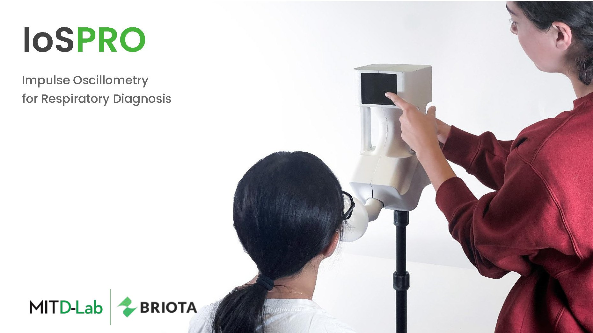

# How does a breathing test become a product instead of a lab instrument?

 full

[gallery carousel] briota-iospro_02.jpg briota-iospro_03.jpg briota-iospro_04.jpg briota-iospro_05.jpg briota-iospro_06.jpg briota-iospro_07.jpg briota-iospro_08.jpg briota-iospro_09.jpg briota-iospro_10.jpg briota-iospro_11.jpg briota-iospro_12.jpg briota-iospro_13.jpg briota-iospro_14.jpg briota-iospro_15.jpg briota-iospro_16.jpg briota-iospro_17.jpg briota-iospro_18.jpg briota-iospro_19.jpg briota-iospro_20.jpg briota-iospro_21.jpg briota-iospro_22.jpg

[section] Appendix

[gallery carousel] briota-iospro_24.jpg briota-iospro_25.jpg briota-iospro_26.jpg briota-iospro_27.jpg briota-iospro_28.jpg briota-iospro_29.jpg briota-iospro_30.jpg briota-iospro_31.jpg briota-iospro_32.jpg briota-iospro_33.jpg briota-iospro_34.jpg briota-iospro_35.jpg briota-iospro_36.jpg briota-iospro_37.jpg briota-iospro_38.jpg briota-iospro_39.jpg briota-iospro_40.jpg briota-iospro_41.jpg briota-iospro_42.jpg briota-iospro_43.jpg briota-iospro_44.jpg briota-iospro_45.jpg

