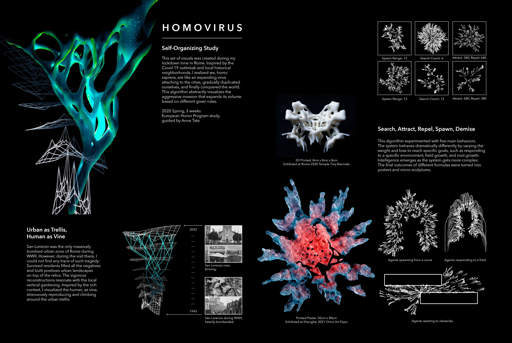
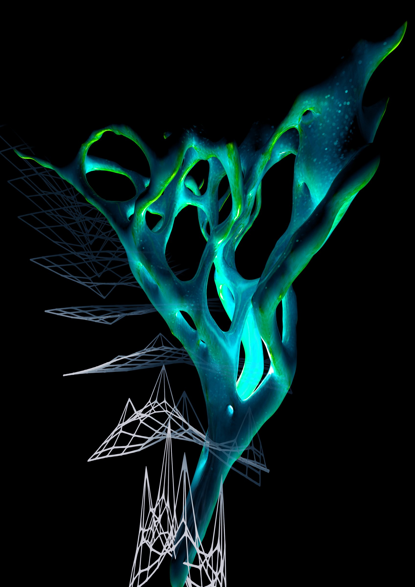
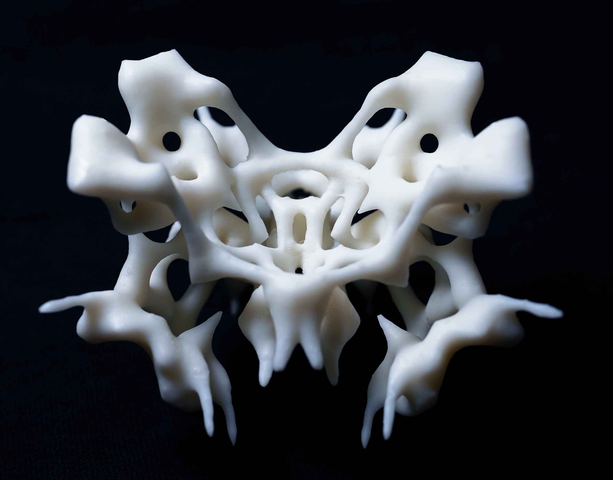
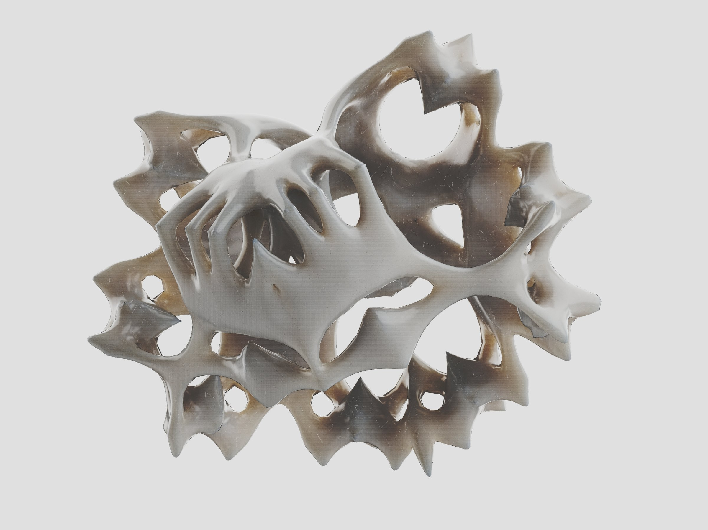
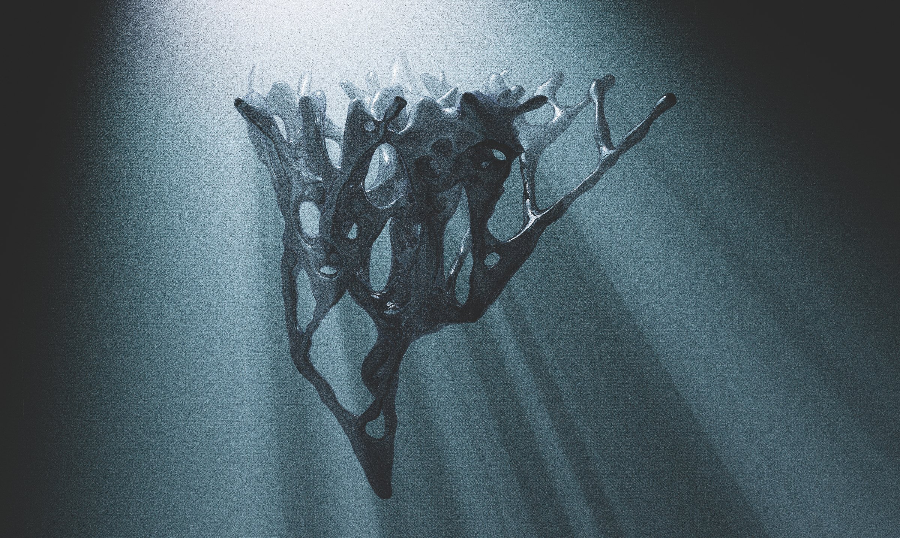
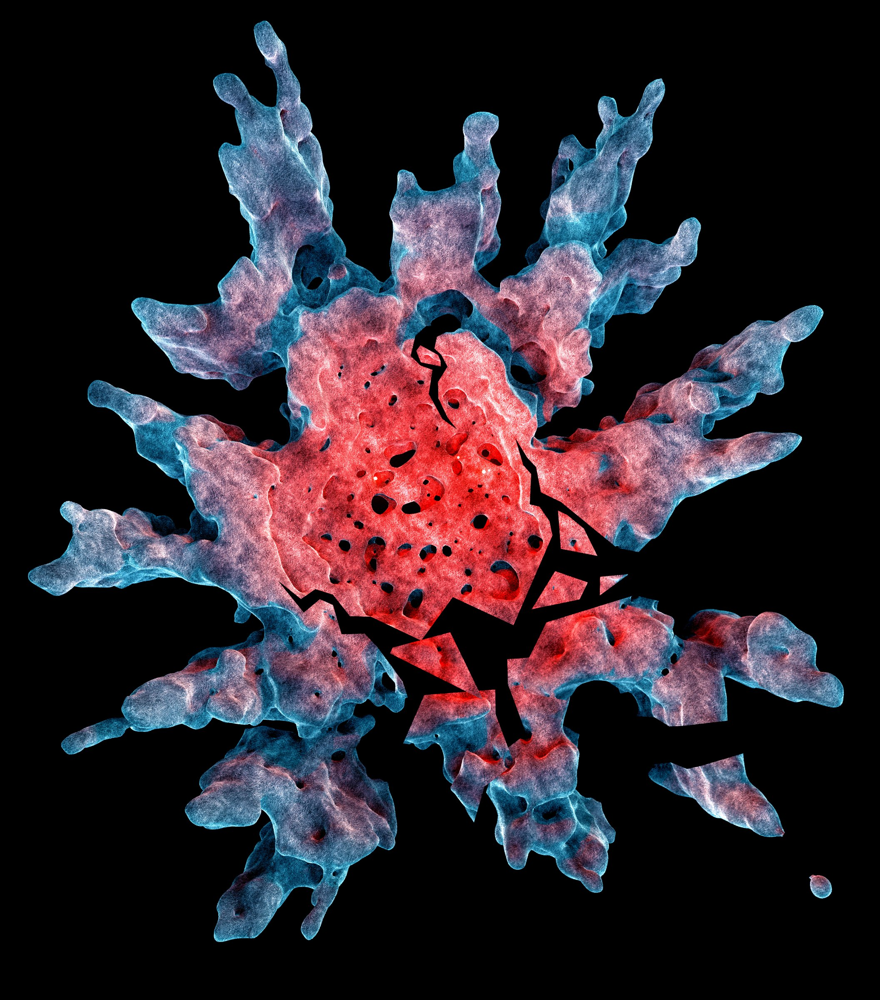
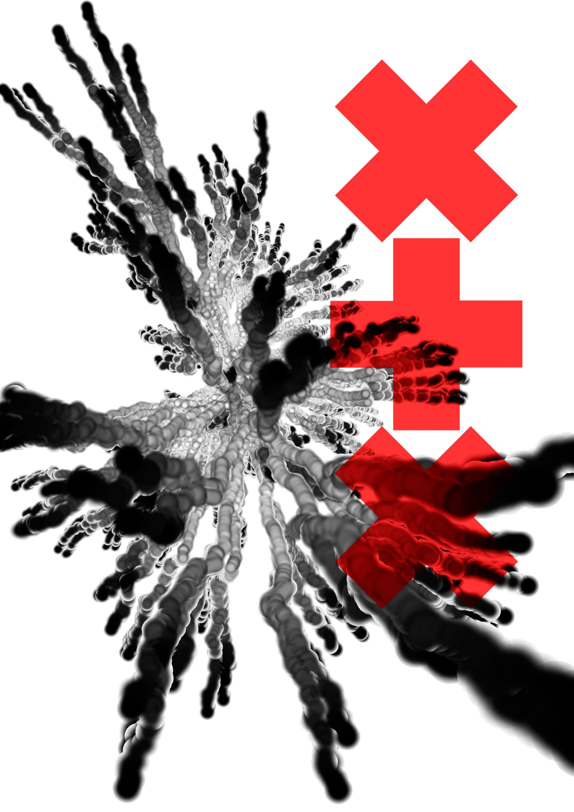
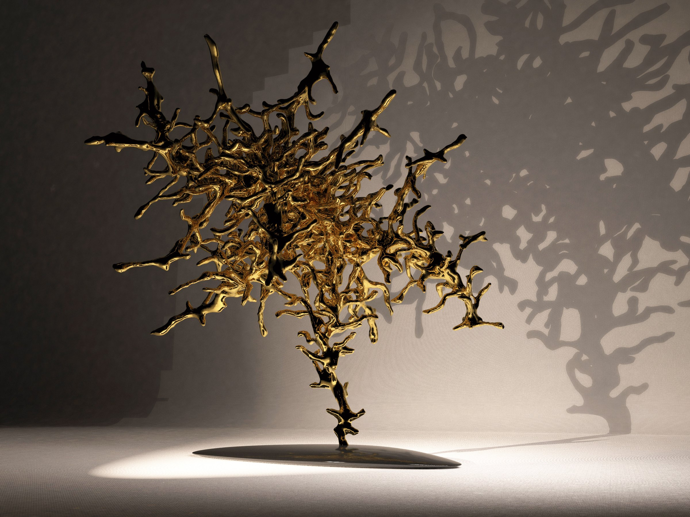
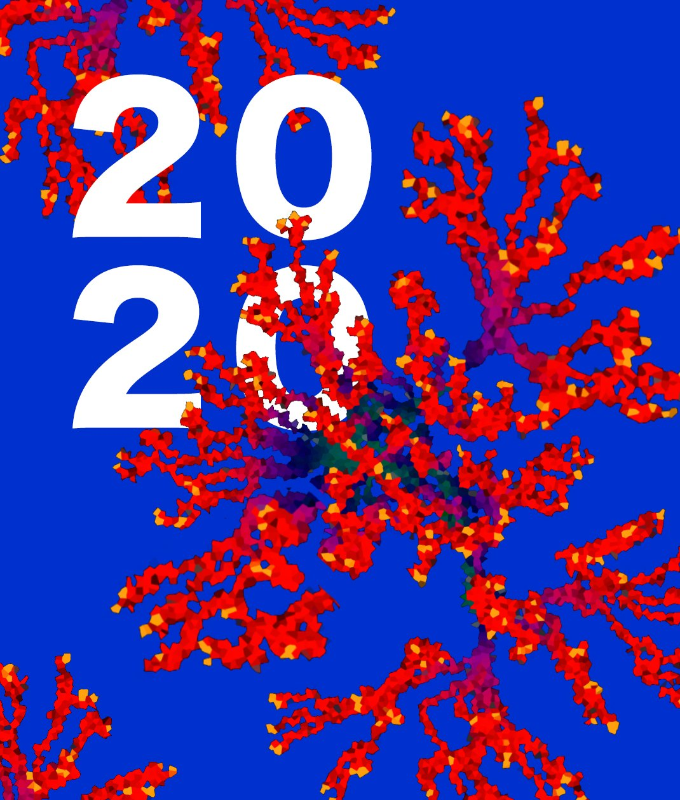
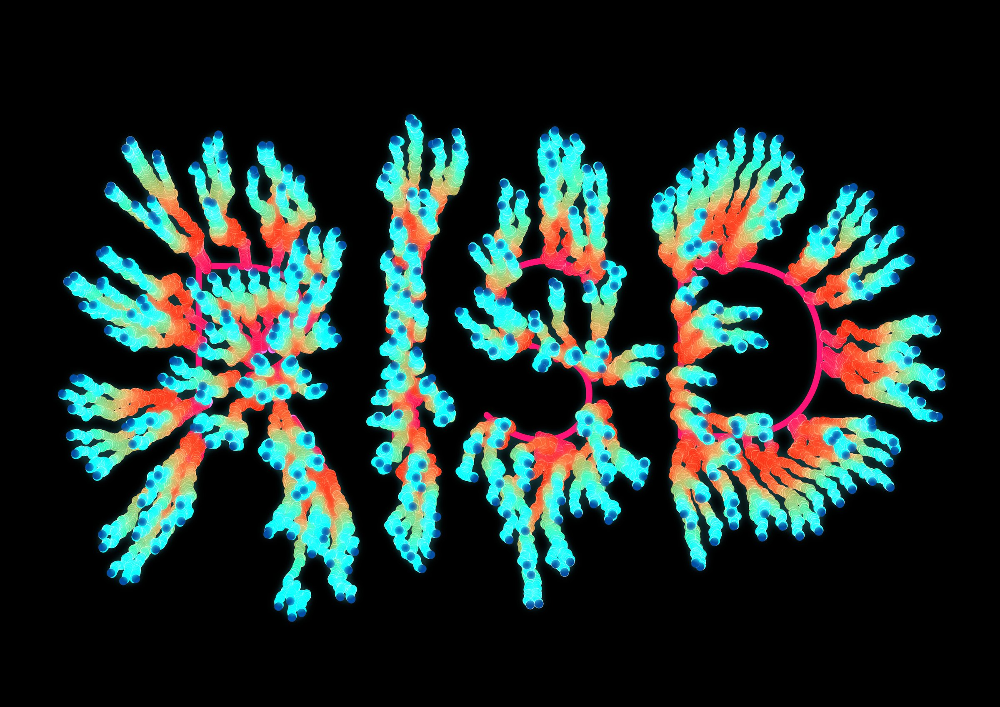

 full

[row]

|
[video] homovirus_03.mp4
[/row]

 half-l

 half-r stagger

 wide-r

[section] Self-Organizing Study

[gallery strip] homovirus_07.mp4 homovirus_08.mp4 homovirus_09.mp4

[video audio wide-l] homovirus_10.mp4

[row 0.5546 0.4454]

|

[/row]

 wide-r

[row 0.3755 0.6245]

|

[/row]
