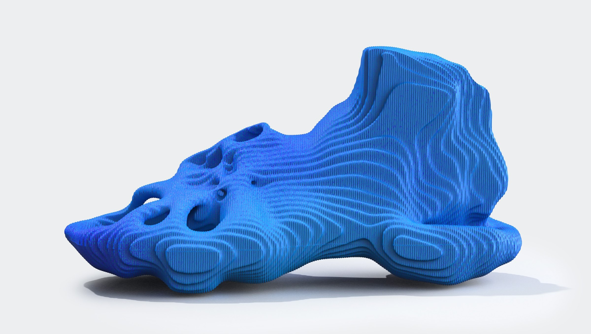
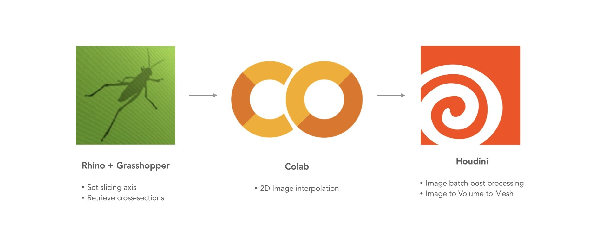
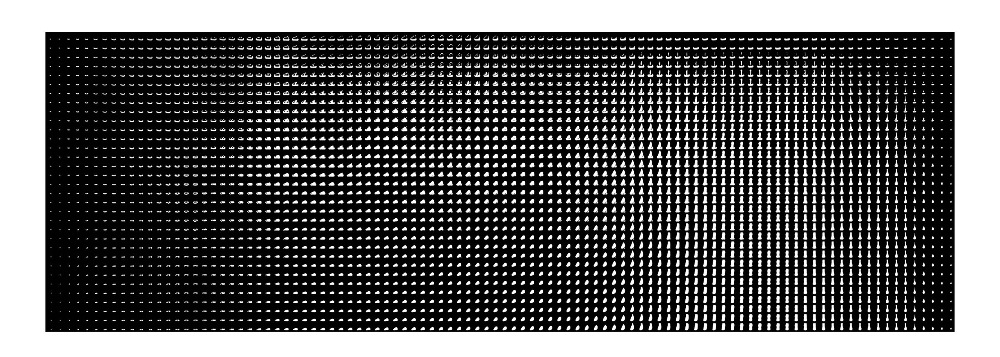

 half-l

This project aims to integrate AI 2D-interpolation techniques into the 3D design process. It involves retrieving geometric sections from a specified slicing axis, and using an interpolation model to explore the latent space between the cross sections. {beside-r}

[gallery grid4 cols=2] hyperslice_03.jpg hyperslice_04.jpg hyperslice_05.mp4 hyperslice_06.mp4

### Image Interpolation Matrix

By utilizing an M by N image matrix (M: total cross section count, N: interpolation in each layer), it empowers user to parametrically blend geometries using a customized curve. This approach enhances control and facilitates seamless integration of diverse geometries.

 full

 | 

### It's also possible to get cross-sections from a non-linear axis, and stack them back together to build a sub-form.

[gallery grid4 cols=4] hyperslice_10.mp4 "1. Input Geometry" hyperslice_11.mp4 "2. Non-linear Slicing Axis" hyperslice_12.mp4 "3. Cross-section" hyperslice_13.mp4 "4. Output Geometry"
