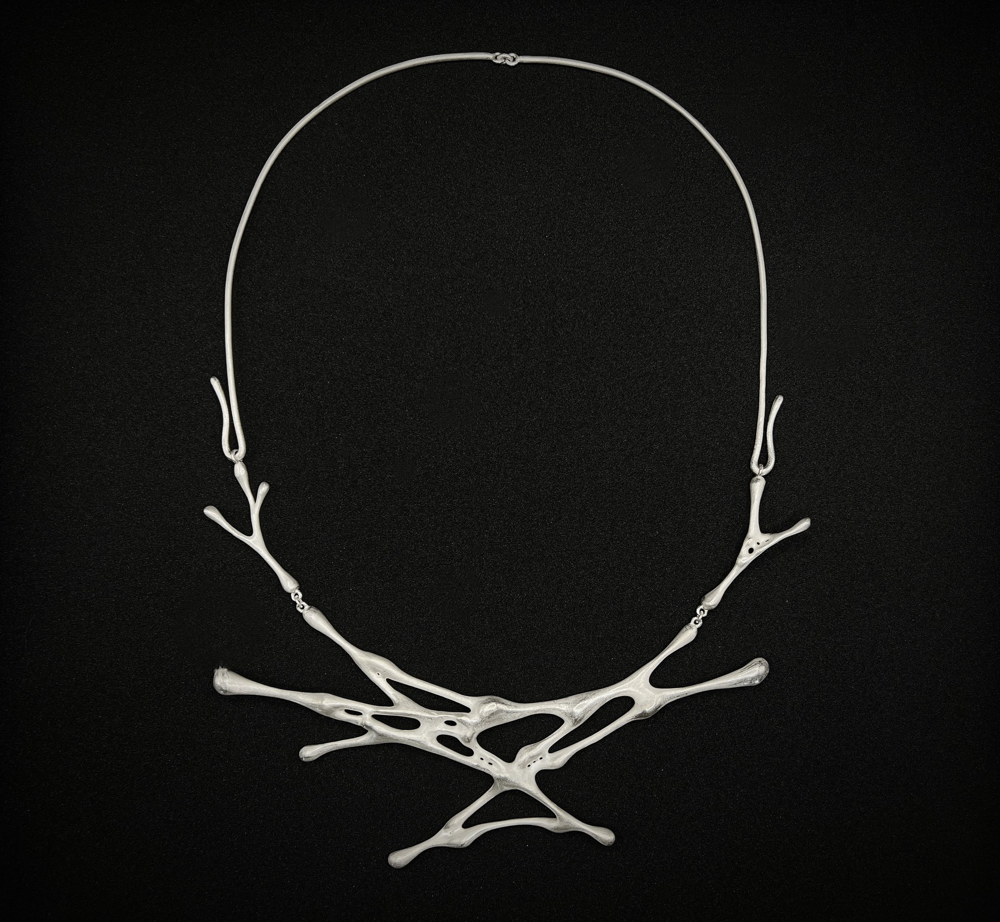
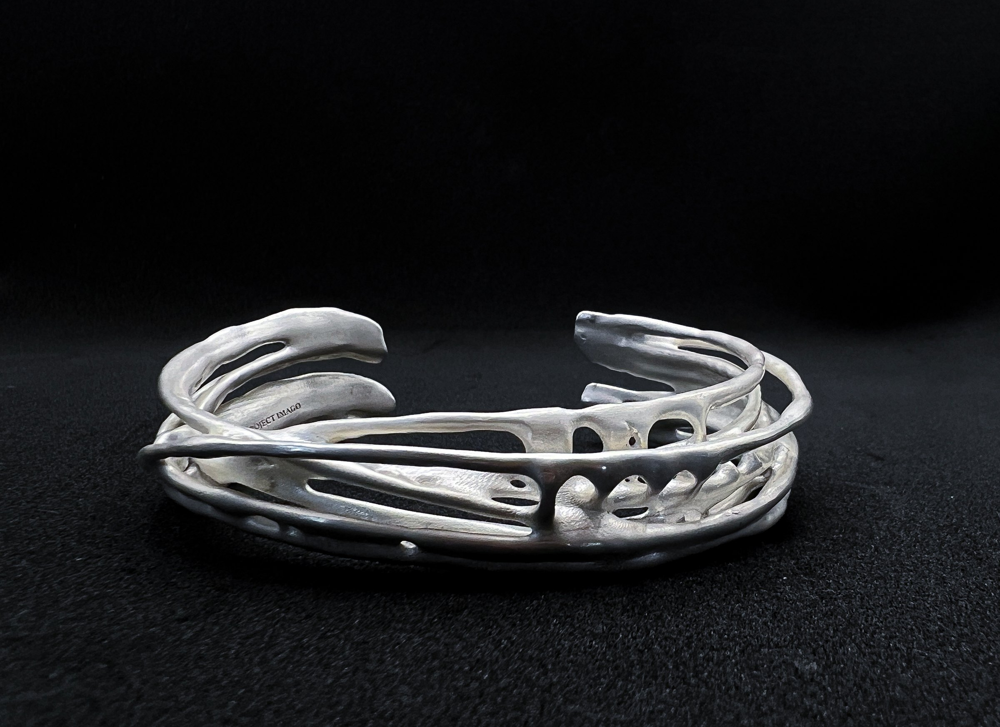
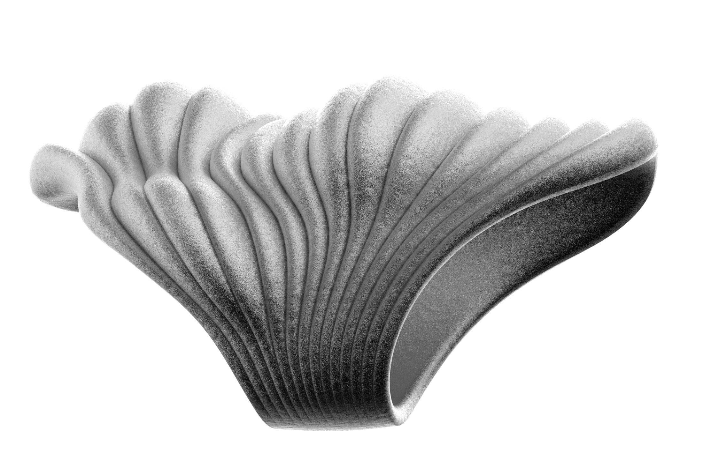
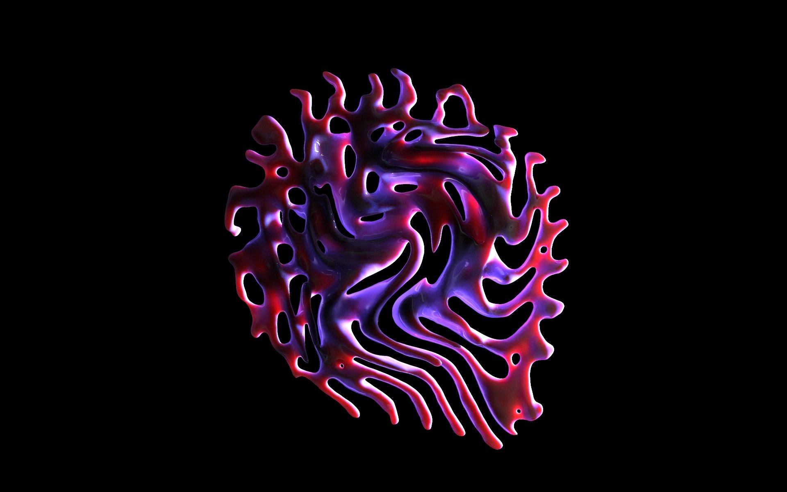
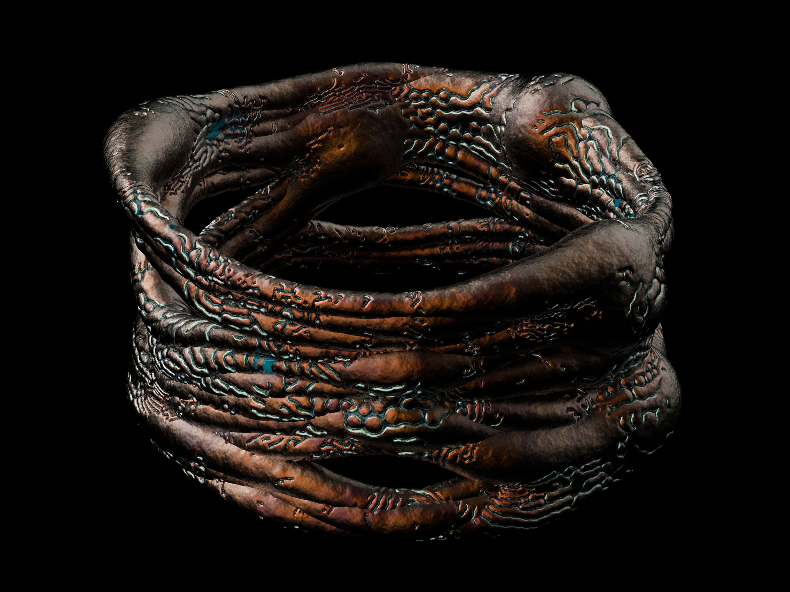

 small-l

Project Imago is a wearable sculpture laboratory led by graduates from Harvard University, Massachusetts Institute of Technology, and Rhode Island School of Design with backgrounds in media design, contemporary jewelry, contemporary painting, industrial design, and architecture. These wearable sculptures are intended to be used as jewelry, with the brand offering parametrically generated bracelets, earrings, and necklaces that go through hand-crafted surface treatments to capture the elusive and unknowable natural imagery. {beside-r}

.") half-l

[gallery grid3] imago_03.jpg imago_04.jpg imago_05.jpg

 narrow-r

[row 0.5912 0.4088]

|

[/row]

[gallery grid3] imago_09.jpg imago_10.jpg

[row 0.358 0.642]

|

[/row]

 wide-l

### This page shows some of the early studies of Project Imago, starting at 2021. {text-l}

 half-l

 half-r

↗↗↗

Our experimental surface processing technique creates lightweight, hollow-shell jewelry. This design ensures comfortable wear and embodies the dynamic contrast of decay and vitality inherent in pupas. {text-r}

 half-l

[section] Other Digital Explorations

 tri-a

 tri-b

 tri-c

[gallery grid2] imago_20.jpg imago_21.jpg
