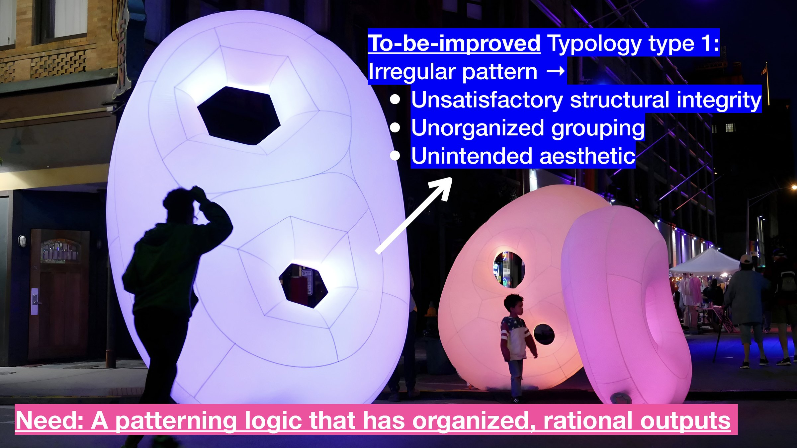
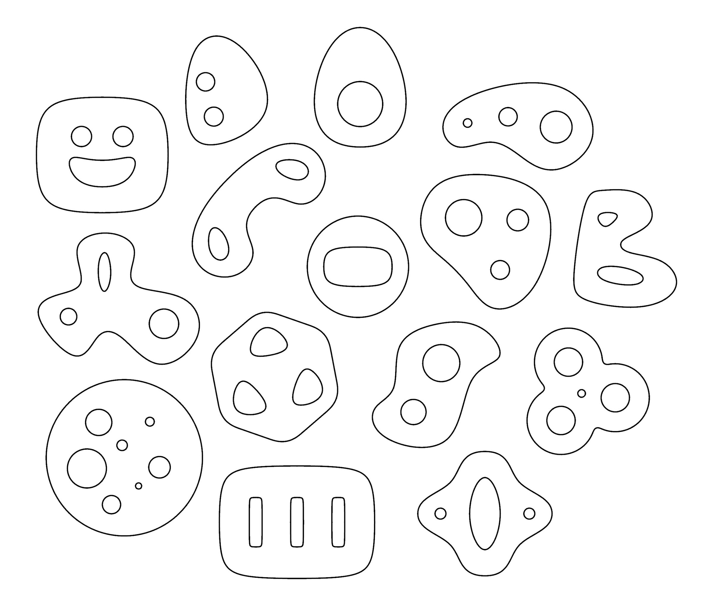
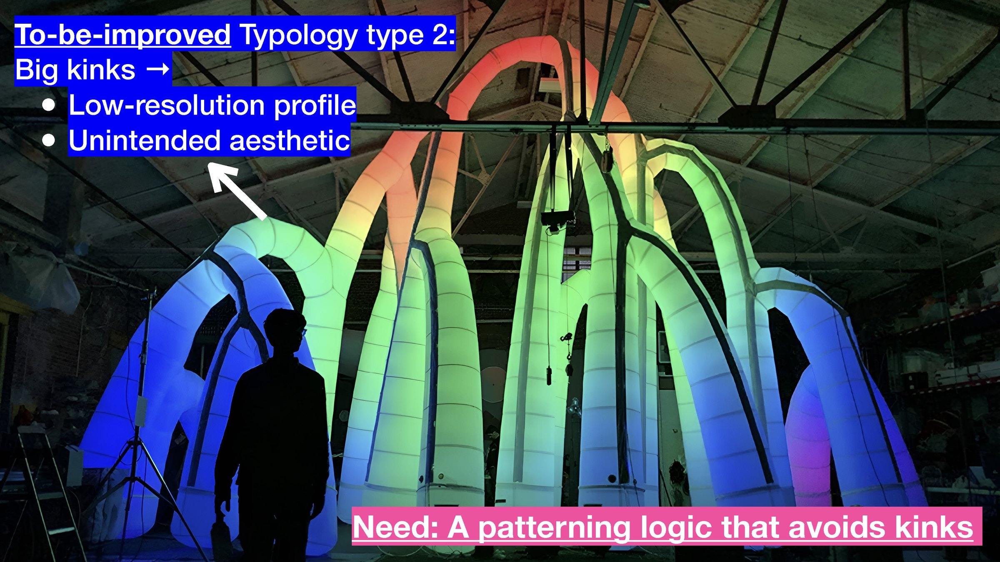
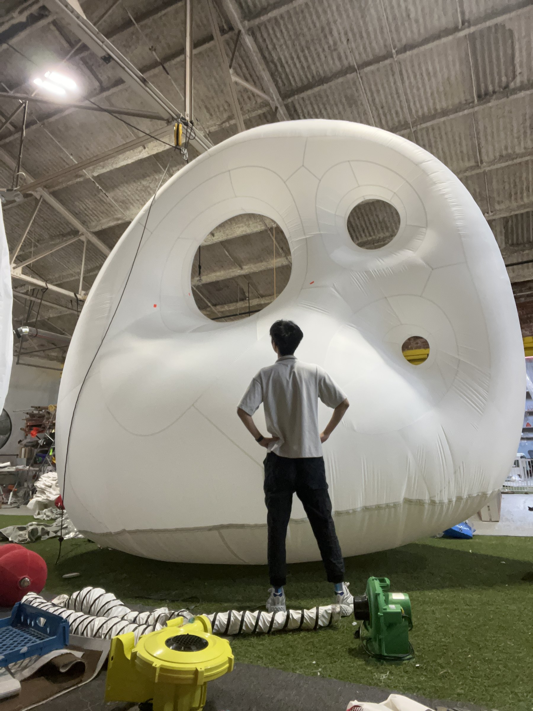
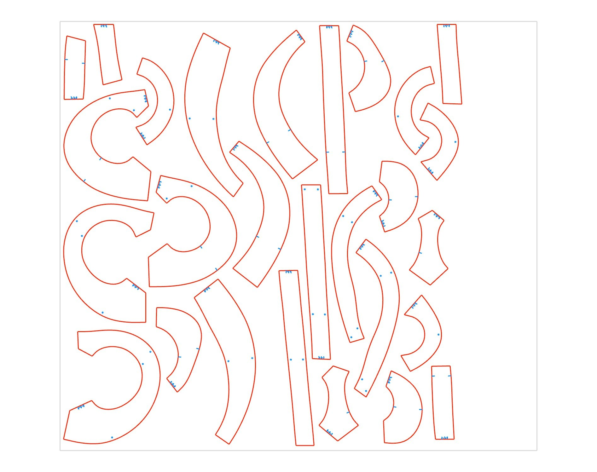
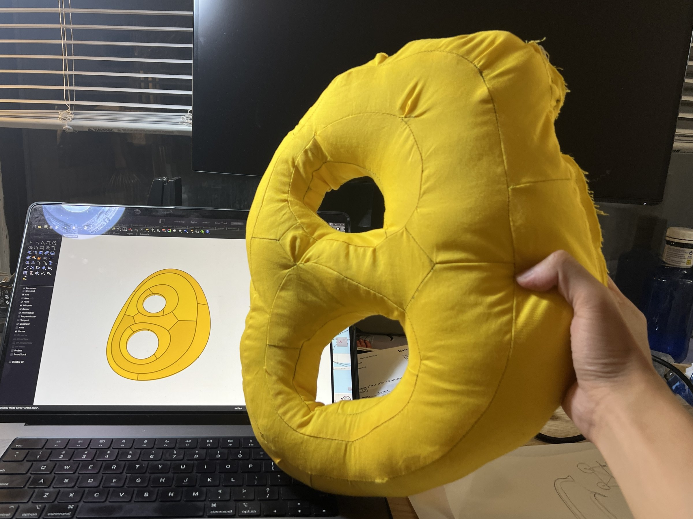
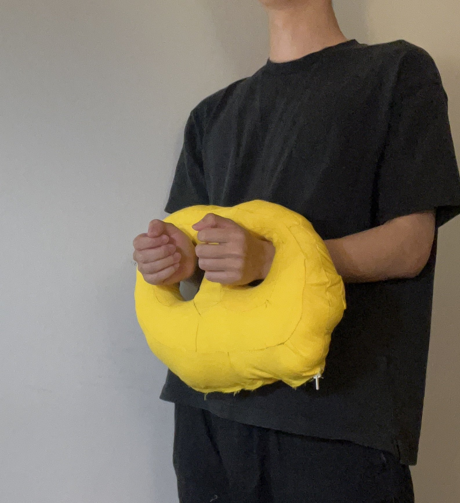

<!-- 使用说明（这段不会显示在网站上，可以删）
段落之间空一行。可以直接改：文字、图片文件名、先后顺序。_sheet.jpg 里有全部图片的缩略图和文件名。

  # 一句话                 整页大字 statement
  ## 标题 / ### 小标题      正文里的标题，后面的段落跟它一组
  [section] 文字           小字分节标签 + 分隔线
                 一张图；后面加一个词指定宽度：full / wide-l / wide-r / half-l / half-r / narrow-l / narrow-r
                           再加 stagger = 比旁边那张往下错开；什么都不加 = 自动排
          图的说明文字（鼠标悬停显示）
         可点击的图
   |   两张并排，底边自动对齐
  [gallery cols=3] a b c   多图组，每行最多 3 张；[gallery carousel] = 轮播；[gallery stack] = 一张一行
  [video] 文件.mp4          带播放条的视频； = 循环小动画
  [row 0.4 0.6] ... [/row] 多列，数字是列宽比例，列和列之间单独一行写 |
  段落末尾 {text-l}         文字固定在左栏（{text-r} 右栏）
  用 HTML 注释包起来         暂时隐藏，文件照留（和这段说明一样的写法）

不想管排版就把排版词删掉，自动规则会排。完整说明：docs/submitting-a-project.md
-->

# How to procedurally generate DMF file for inflatable structures?

...
June 2023 - August 2023 at [Pneuhaus](https://www.pneu.haus/) under guidance of August Lekrecke.

Over the 8 weeks, I developed C# scripts in Grasshopper for generating production files for inflatable structures. This workflow accelerates entire design process, from form-finding, patterning, labeling, unrolling, and simulation, adaptable to various input topologies and pattern types. It uses the half-edge data structure to enhance performance and robustness.

## **Solution 1: Closed Boundaries (2D Input)**

Turn almost any flat doodle drawing into manufacturable inflatable.

 | 

The grasshopper definition enables users to freely modify the patterning design for aesthetic, structural, and manufacturing purposes. The segmentation count, length, width, seam alignment, and other parameters can all be easily adjusted based on the needs.

[gallery grid4] inflatable-patterner_04.jpg "1. Draw input boundaries" inflatable-patterner_05.jpg "2. Extract skeleton" inflatable-patterner_06.jpg "3. Construct mountain" inflatable-patterner_07.jpg "4. Get contours" inflatable-patterner_08.jpg "5. Triangular remesh" inflatable-patterner_09.jpg "6. Add volumne" inflatable-patterner_10.jpg "7. Subdivide and simulate inflation" inflatable-patterner_11.jpg "8. Finalize pattern"

[gallery grid3] inflatable-patterner_13.jpg inflatable-patterner_14.jpg inflatable-patterner_15.jpg inflatable-patterner_16.jpg inflatable-patterner_17.jpg inflatable-patterner_18.jpg

## **Solution 2: Line Networks (3D Input)**

Turn almost any 3D line networks into manufacturable inflatables with a smoother output profile.

[gallery grid4] inflatable-patterner_20.mp4 inflatable-patterner_21.mp4 inflatable-patterner_22.mp4 inflatable-patterner_23.mp4 inflatable-patterner_24.mp4 inflatable-patterner_25.mp4 inflatable-patterner_26.mp4 inflatable-patterner_27.mp4 inflatable-patterner_28.mp4 inflatable-patterner_29.mp4 inflatable-patterner_30.mp4 inflatable-patterner_31.mp4 inflatable-patterner_32.mp4 inflatable-patterner_33.mp4 inflatable-patterner_34.mp4 inflatable-patterner_35.mp4 inflatable-patterner_36.mp4 inflatable-patterner_37.mp4 inflatable-patterner_38.mp4 inflatable-patterner_39.mp4

### Adaptive to Design / Manufacturing needs:

The below animation demonstrates the adjustable nature of the complex strip's width (highlighted in blue), while the simple strip's patterning (shown in grey) also automatically adapts to the width change. This feature, specifically requested by my advisor, introduces greater flexibility in fine-tuning design and fabrication processes.

### Assembly Guide I: Group Search

The diagram and animation above show the general steps and the mapping between 3D geometry and 2D flattened pieces. The GIF on the right serves as a group dictionary that shows the overall assembly sequence.

[gallery grid4] inflatable-patterner_41.jpg "1. Draw connect lines" inflatable-patterner_42.jpg "2. Thicken lines (Using Mesh Fattener or Multipipe by Daniel Piker)" inflatable-patterner_43.jpg "3. Dispatch complex (vertex valence > 4) and simple regions" inflatable-patterner_44.jpg "4. Divide regions into panels. The panels will be reconstructed as patch mesh for unroll purpose."

### Assembly Guide II: Neighbor Search

The diagram and animation below show the neighbor relationship and the example file of the cutting and plotting profiles. This feature assists fabricator to quickly index the neighbor pieces

[row 0.6 0.4]

|
[gallery stack] inflatable-patterner_47.jpg inflatable-patterner_48.jpg
[/row]

### **If you are interested in my thinking process, please take a look at the log[ HERE](https://kaizhg.notion.site/2023-Summer-Pneuhaus-Intern-Log-f12c62426d6a49c2ad19600da80ba9c7?pvs=74).**

### Below is another example of the first logic: CLOUD Pillow\
You can check the process on my [How to Make (almost) Anything](https://fab.cba.mit.edu/classes/863.23/Harvard/people/Kai/index.html#week_2) site.

[gallery grid4] inflatable-patterner_51.jpg inflatable-patterner_52.jpg inflatable-patterner_53.jpg inflatable-patterner_54.jpg

### ↑ : Perfect machine cutting\
↓ : Terrible human sewing

[gallery grid4] inflatable-patterner_55.jpg inflatable-patterner_56.jpg inflatable-patterner_57.jpg inflatable-patterner_58.jpg

[row 0.5933 0.4067]

|

[/row]
