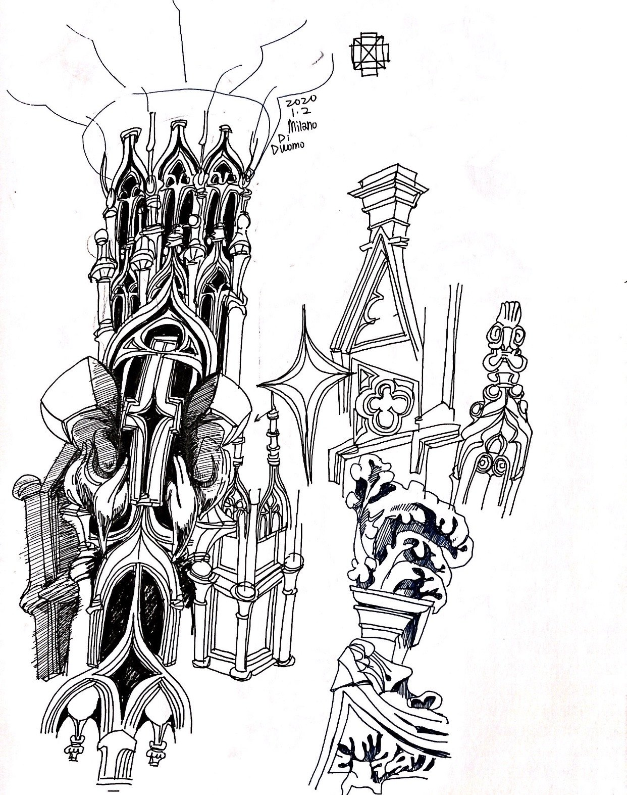

<!-- 使用说明（这段不会显示在网站上，可以删）
段落之间空一行。可以直接改：文字、图片文件名、先后顺序。_sheet.jpg 里有全部图片的缩略图和文件名。

  # 一句话                 整页大字 statement
  ## 标题 / ### 小标题      正文里的标题，后面的段落跟它一组
  [section] 文字           小字分节标签 + 分隔线
                 一张图；后面加一个词指定宽度：full / wide-l / wide-r / half-l / half-r / narrow-l / narrow-r
                           再加 stagger = 比旁边那张往下错开；什么都不加 = 自动排
          图的说明文字（鼠标悬停显示）
         可点击的图
   |   两张并排，底边自动对齐
  [gallery cols=3] a b c   多图组，每行最多 3 张；[gallery carousel] = 轮播；[gallery stack] = 一张一行
  [video] 文件.mp4          带播放条的视频； = 循环小动画
  [row 0.4 0.6] ... [/row] 多列，数字是列宽比例，列和列之间单独一行写 |
  段落末尾 {text-l}         文字固定在左栏（{text-r} 右栏）
  用 HTML 注释包起来         暂时隐藏，文件照留（和这段说明一样的写法）

不想管排版就把排版词删掉，自动规则会排。完整说明：docs/submitting-a-project.md
-->

Most of the drawings are drawn on paper, scanned, and colored with digital tool.

[gallery grid3] ink-on-paper_01.jpg "Sunflowers, 2019" ink-on-paper_02.jpg "Inspired by Death Burger, 2019" ink-on-paper_03.jpg "Brooklyn, 2018"

[gallery grid3] ink-on-paper_04.jpg "Childhood, 2019" ink-on-paper_05.jpg "2019" ink-on-paper_06.jpg "HOID Sketch, 2019"

[gallery grid3] ink-on-paper_07.jpg ink-on-paper_08.jpg ink-on-paper_09.jpg

[gallery grid2 @3-11] ink-on-paper_10.jpg ink-on-paper_11.jpg

[gallery grid4 cols=4] ink-on-paper_13.jpg ink-on-paper_14.jpg ink-on-paper_15.jpg ink-on-paper_16.jpg

[gallery cols=5] ink-on-paper_17.jpg "Bowling Demon, 2020" ink-on-paper_18.jpg "Happy Valentine, 2020" ink-on-paper_19.jpg "颓, 2020" ink-on-paper_20.jpg "Untitled, 2020" ink-on-paper_21.jpg "Virginity, 2020"

[gallery cols=4] ink-on-paper_22.jpg "Pressure, 2020" ink-on-paper_23.jpg "Wanxia Village, 2020" ink-on-paper_24.jpg "Random machine, 2019" ink-on-paper_25.jpg

[section] Stickers

[gallery grid5] ink-on-paper_26.png ink-on-paper_27.png ink-on-paper_28.png ink-on-paper_29.png ink-on-paper_30.png

[section] Sketchbook

[gallery cols=4] ink-on-paper_31.jpg ink-on-paper_32.jpg ink-on-paper_33.jpg ink-on-paper_34.jpg ink-on-paper_35.jpg ink-on-paper_36.jpg ink-on-paper_37.jpg ink-on-paper_38.jpg ink-on-paper_39.jpg ink-on-paper_40.jpg ink-on-paper_41.jpg ink-on-paper_42.jpg ink-on-paper_43.jpg ink-on-paper_44.jpg

This page only shows a very small percentage of all my drawings/sketches/doodles!
