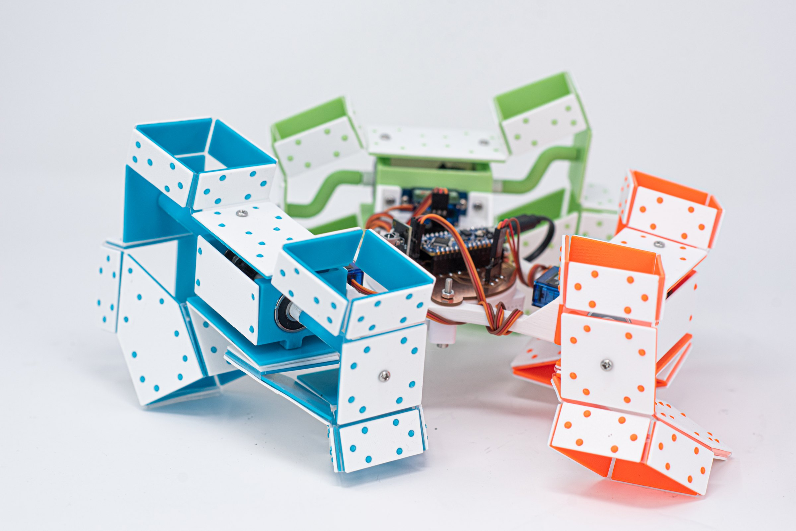
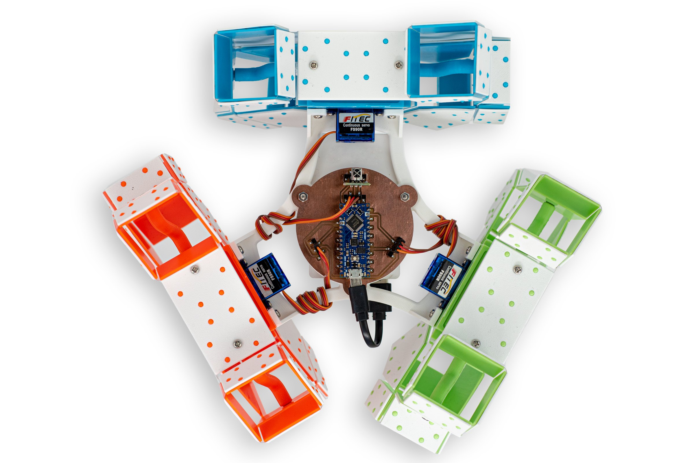
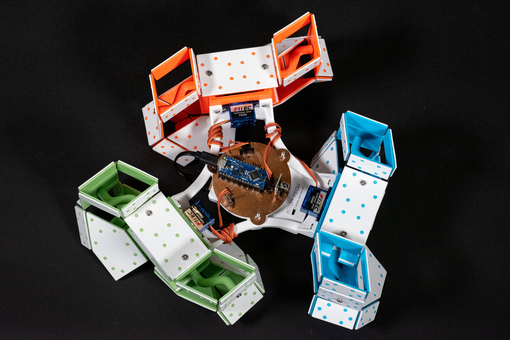
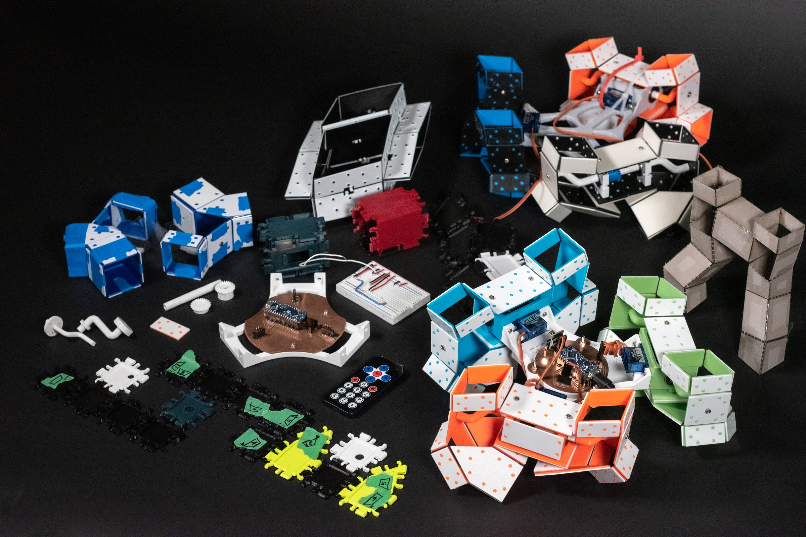

My Contributions:\
[1] Collaborated with Professor Hoberman, together we adapted the new fabrication method (3D-printed panels + Mylar) into final production.\
[2] Used grasshopper to procedurally generate whole robot and simulate its movement.\
[3] Defined the final aesthetic and overall details, and prepared production files.

### This page is still under construction.

 full

 wide-r

[video audio full] invertebot_05.mp4

[section] Custom grasshopper design and simulation tool

[video wide-l] invertebot_06.mp4

[video small-r stagger] invertebot_07.mp4
