<!-- 使用说明（这段不会显示在网站上，可以删）
段落之间空一行。可以直接改：文字、图片文件名、先后顺序。_sheet.jpg 里有全部图片的缩略图和文件名。

  # 一句话                 整页大字 statement
  ## 标题 / ### 小标题      正文里的标题，后面的段落跟它一组
  [section] 文字           小字分节标签 + 分隔线
                 一张图；后面加一个词指定宽度：full / wide-l / wide-r / half-l / half-r / narrow-l / narrow-r
                           再加 stagger = 比旁边那张往下错开；什么都不加 = 自动排
          图的说明文字（鼠标悬停显示）
         可点击的图
   |   两张并排，底边自动对齐
  [gallery cols=3] a b c   多图组，每行最多 3 张；[gallery carousel] = 轮播；[gallery stack] = 一张一行
  [video] 文件.mp4          带播放条的视频； = 循环小动画
  [row 0.4 0.6] ... [/row] 多列，数字是列宽比例，列和列之间单独一行写 |
  段落末尾 {text-l}         文字固定在左栏（{text-r} 右栏）
  用 HTML 注释包起来         暂时隐藏，文件照留（和这段说明一样的写法）

不想管排版就把排版词删掉，自动规则会排。完整说明：docs/submitting-a-project.md
-->

# **Engaging with Large Language Models through Tangible Experiences:**

[section] Part I: AIncense

 wide-r

<!--  -->

### AIncense is a praying device powered by ChatGPT, designed to amplify self-motivation through psychological suggestion.

AIncense integrates the comprehensive capabilities of ChatGPT to revolutionize and expand our perception of religious authority. This innovative platform empowers users to foster a routine of self-empowerment and inspiration. Whether making a wish, confessing, or navigating daily life, AIncense provides a unique space for personal reflection and growth.

[row 0.6917 0.3083]
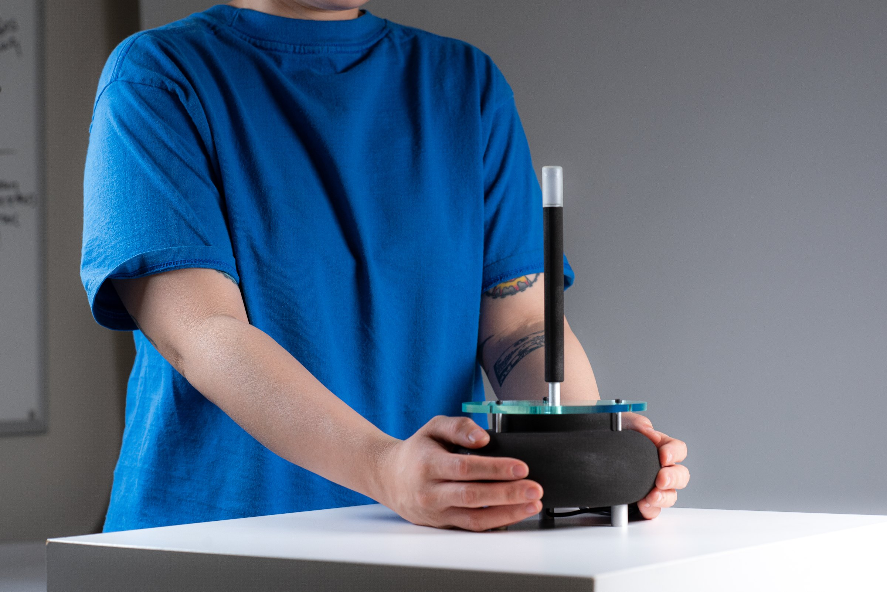
|
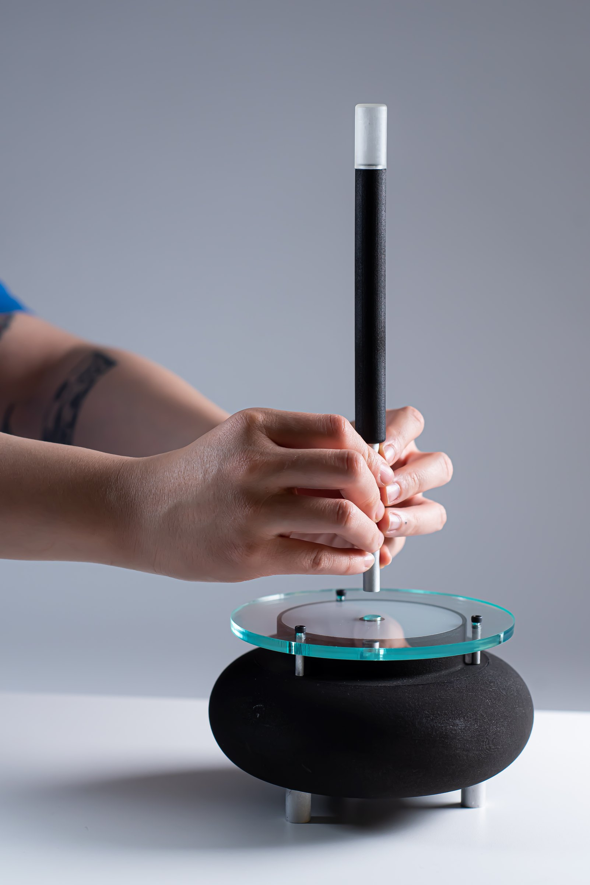
[/row]

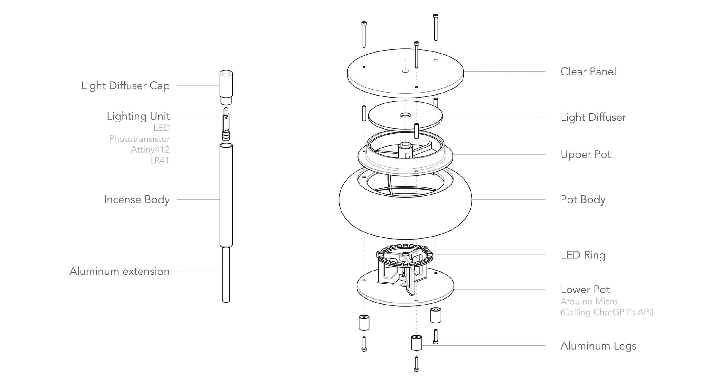 wide-l

[youtube] https://www.youtube.com/watch?v=9Aasryk0lOA

[row]
### AIncense 2.0 (Locally deployed LLM)

In Fall 2024, I had a chance to revisit this project, and made a hardware design that truly enables this interaction. With the support from MIT HAN Lab, I was able to make a smart incense that locally communicates with Large Language. Please click the following links to see detail for the 2nd Iteration:

### **[>>> Overview](https://fab.cba.mit.edu/classes/863.23/Harvard/people/Kai/index.html#final)**\
**[>>> Process Documentation](https://fab.cba.mit.edu/classes/863.23/Harvard/people/Kai/index.html#final_tracking)**
|
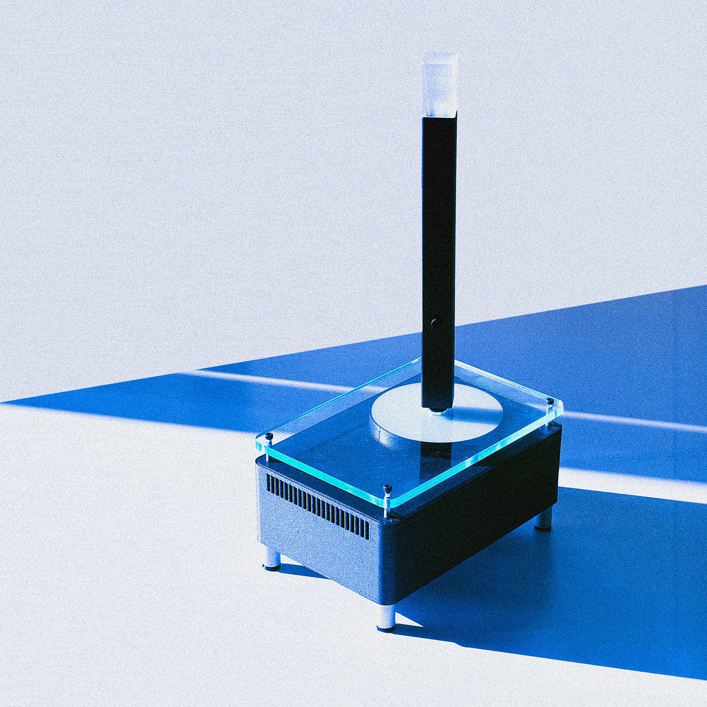
[/row]

[gallery grid3] large-language-objects_07.jpg large-language-objects_08.jpg

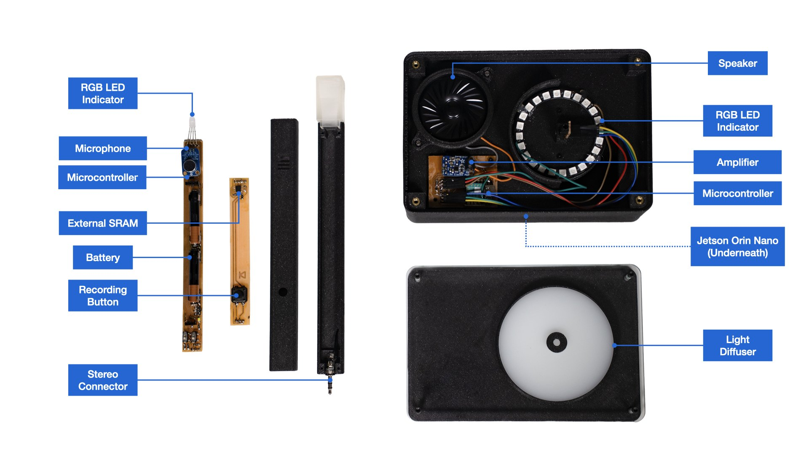 wide-r

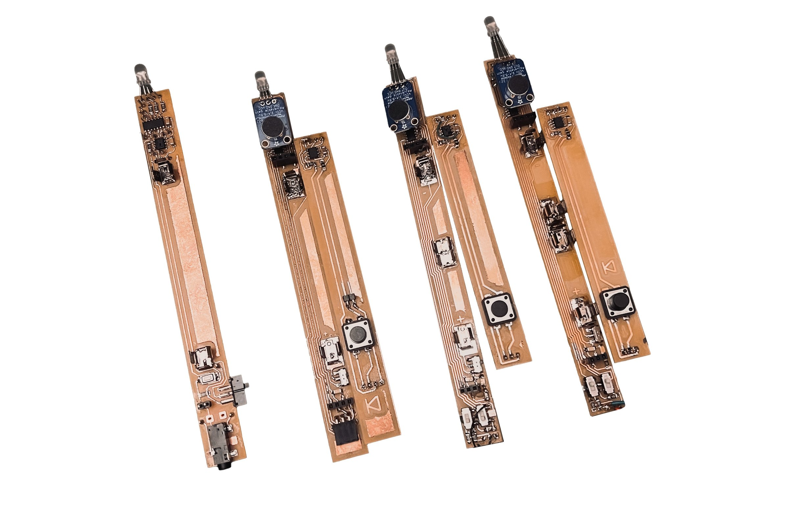 half-l

[section] Part II: MIT HAN Lab Local Voice Assistant

[row 0.645 0.355]

|
### A modular design for edge computing

This device envisions how modularity works for edge computing hardware. The base computing module is powered by Nvidia Jetson Orin Nano, while the top module could be easily changed according to the need. Here presents a speakerphone module as example.\
\
The client and technical support for this project is MIT HAN Lab, founded by Professor Song Han. HAN lab stands at the forefront of cutting-edge research, encompassing a wide spectrum of topics from LLM and genAI to TinyML and hardware design.
[/row]

[row]
### Technology

This voice assistant and TinyChat computer uses the TinyChatEngine software from MIT HAN Lab. It runs Meta's latest LLaMA-2 model at 30 tokens / second on NVIDIA Jetson Orin Nano and can easily support different models and hardware. For more details on the software side please visit MIT HAN Lab. All of Tinychat computer's hardware are custom designed except the keys. We wanted to craft the most compact interface for portability and personalization
|
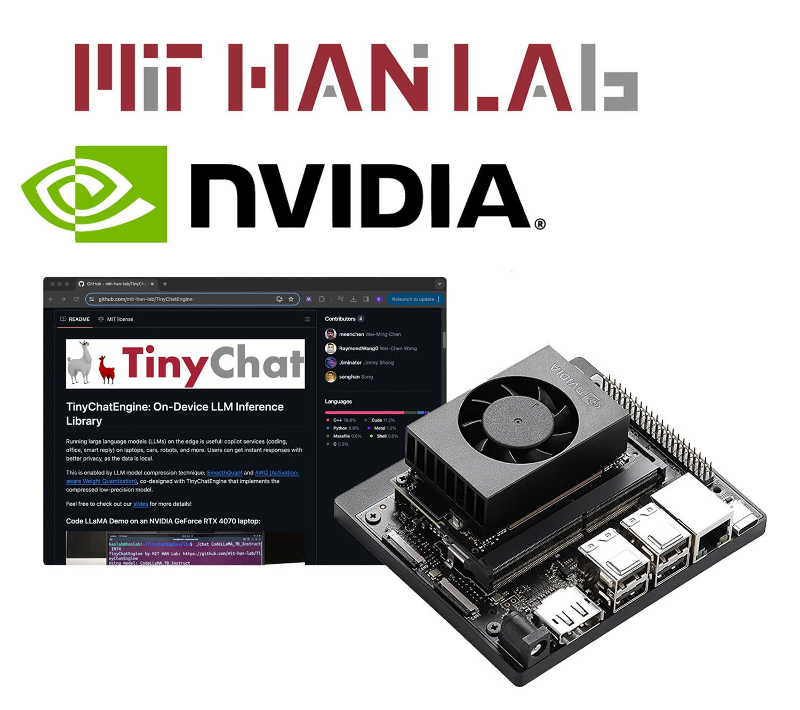
[/row]

[row 0.535 0.465]
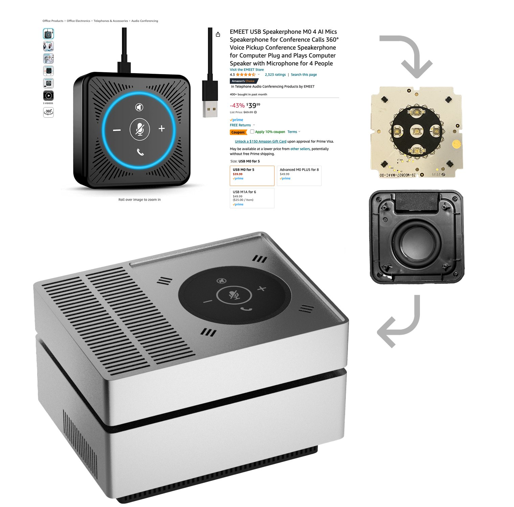
|
### Design Decision:\
Off-the-shelf speaker module

Some design decisions were made as we (Spatial Dynamics, a local industrial design consultancy studio who commissioned me for this project) only had one week to deliver the prototype.

For instance, we disassembled an existing speakerphone product from Amazon, and integrated the speakerphone unit into our design. Although using existing component raised certain limitations, this saved us quiet a lot time from building the hardware from scratch.
[/row]

[row]
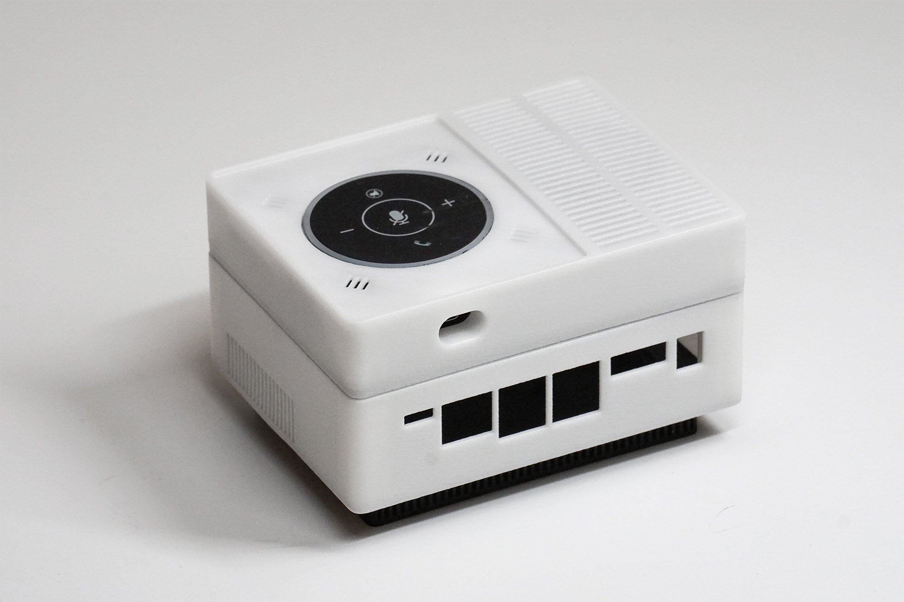
|
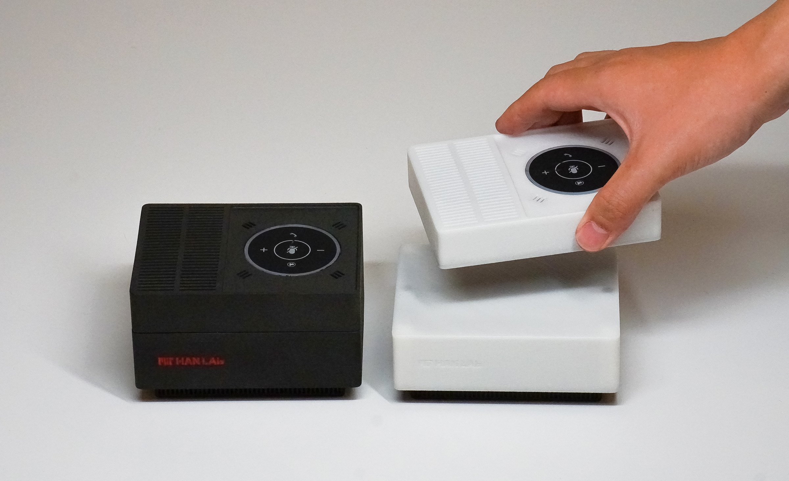
[/row]

Due to time constraint, we decided to use SLS / FDM print for the prototypes, and use an external usb-c cable to power and communicate with the speakerphone unit.

[section] Part III: Tiny Chat Computer

...
For: MIT HAN Lab\
Project team: Quincy Kuang, Lingdong Huang, Kai Zhang, MIT HAN Lab {credits}

[row 0.61 0.39]
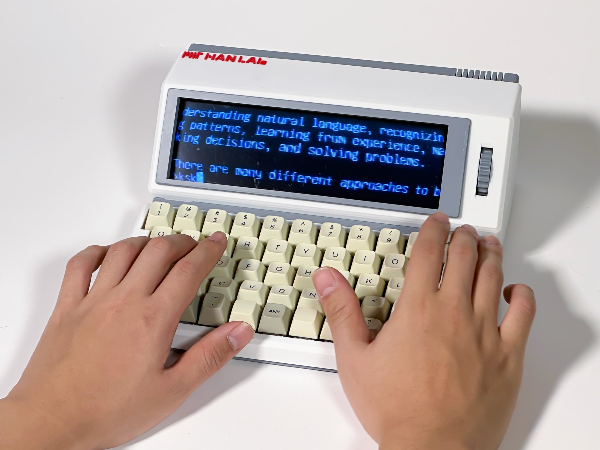
|
### Private personal computing

This integration enables powerful technologies to operate locally, fortifying the safeguarding of personal privacy. "TinyChat" emerges as a pioneering project to explore this very concept. We crafted the TinyChat computer with a design reminiscent of classic computers, both as a tribute to the original idea of a "personal computer" and as a reminder of their historical aesthetics. This raises an interesting query: as AI software evolves, might it also transform the physical form of computers themselves?
[/row]

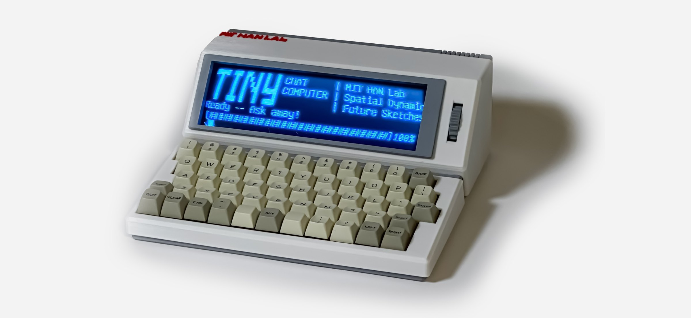 @2-12

[row 0.315 0.685]
All of TinyChat computer's hardware are custom designed except the keys. We wanted to craft the most compact interface for portability, personalization, and of course, the ultimate retro look.
|
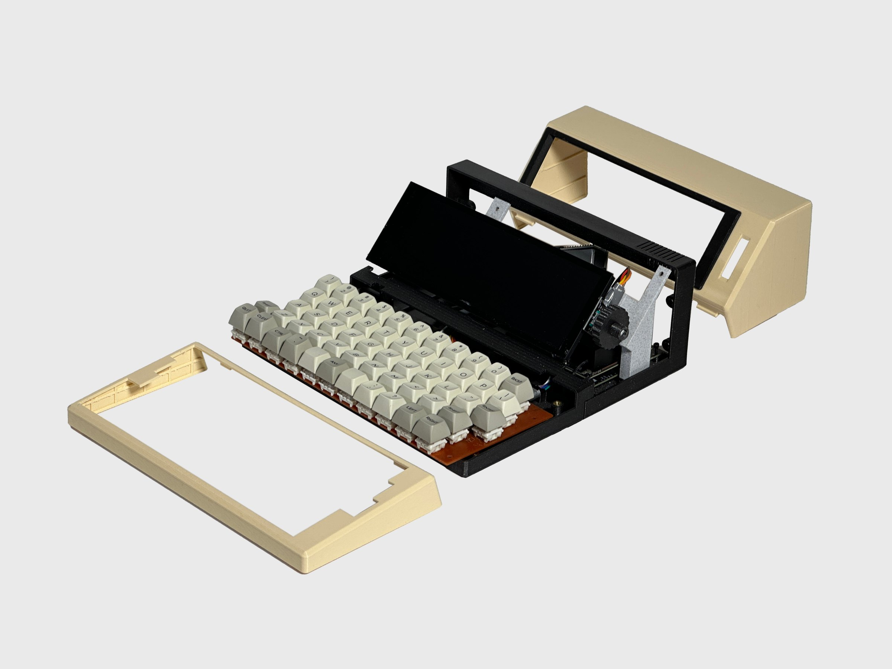
[/row]

[video audio] large-language-objects_19.mp4
