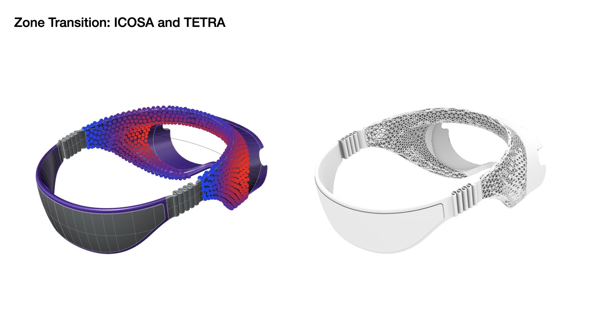
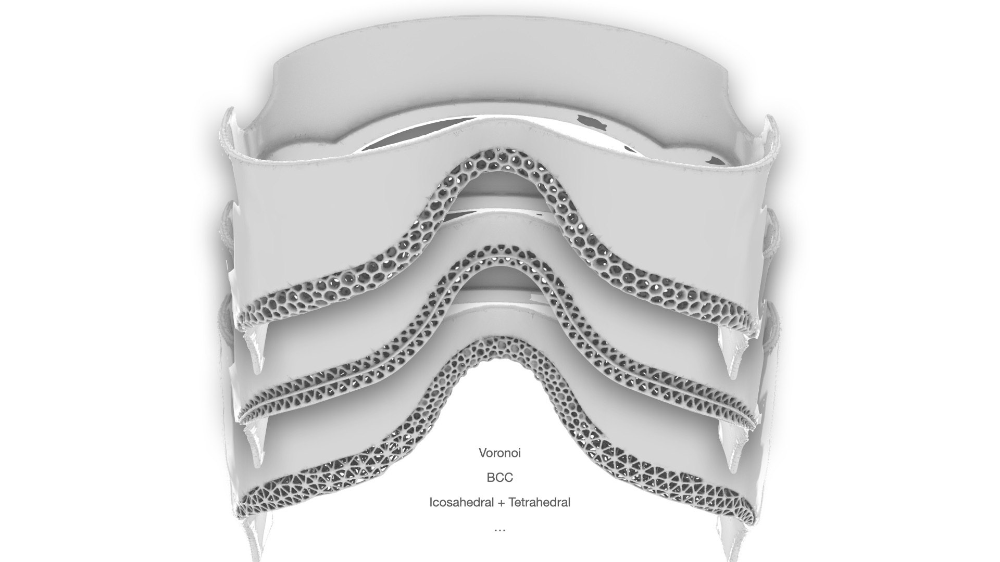
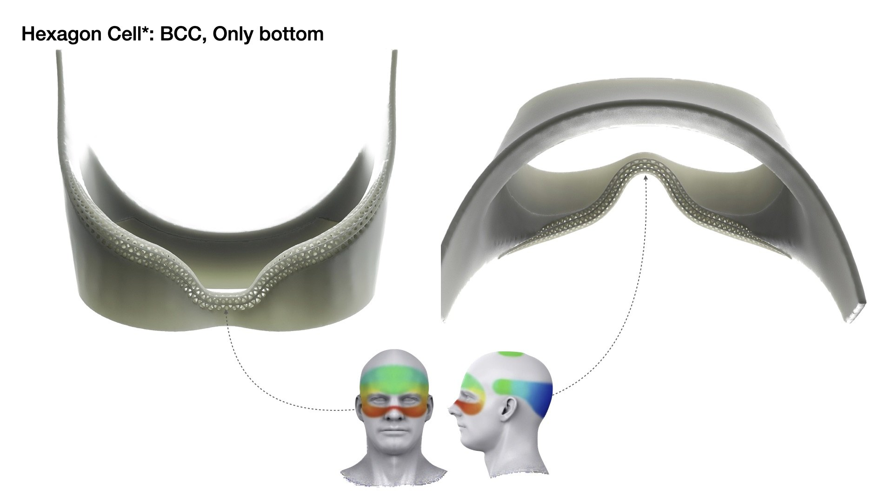
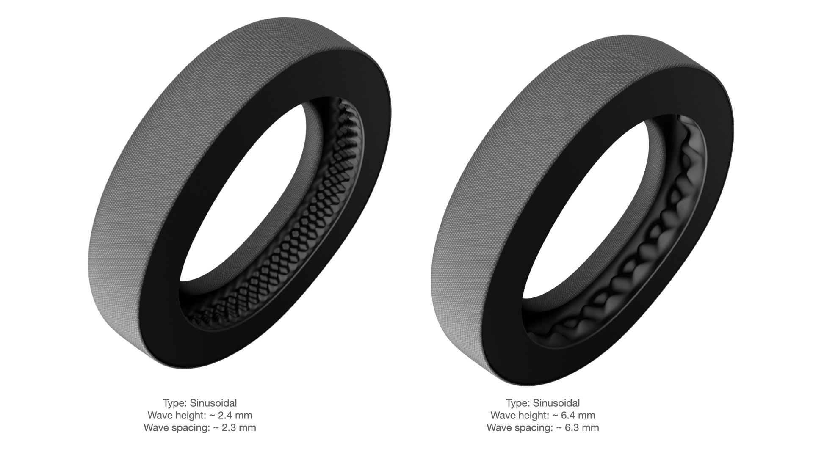
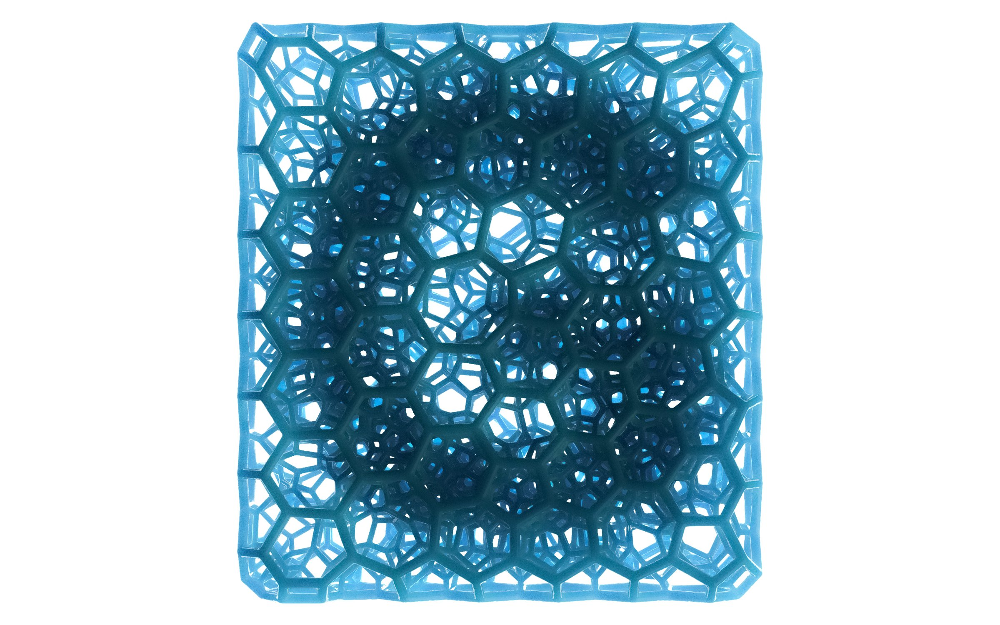

<!-- 使用说明（这段不会显示在网站上，可以删）
段落之间空一行。可以直接改：文字、图片文件名、先后顺序。_sheet.jpg 里有全部图片的缩略图和文件名。

  # 一句话                 整页大字 statement
  ## 标题 / ### 小标题      正文里的标题，后面的段落跟它一组
  [section] 文字           小字分节标签 + 分隔线
                 一张图；后面加一个词指定宽度：full / wide-l / wide-r / half-l / half-r / narrow-l / narrow-r
                           再加 stagger = 比旁边那张往下错开；什么都不加 = 自动排
          图的说明文字（鼠标悬停显示）
         可点击的图
   |   两张并排，底边自动对齐
  [gallery cols=3] a b c   多图组，每行最多 3 张；[gallery carousel] = 轮播；[gallery stack] = 一张一行
  [video] 文件.mp4          带播放条的视频； = 循环小动画
  [row 0.4 0.6] ... [/row] 多列，数字是列宽比例，列和列之间单独一行写 |
  段落末尾 {text-l}         文字固定在左栏（{text-r} 右栏）
  用 HTML 注释包起来         暂时隐藏，文件照留（和这段说明一样的写法）

不想管排版就把排版词删掉，自动规则会排。完整说明：docs/submitting-a-project.md
-->

# What if a cushion could be grown to fit the body that sits on it?

Lattice++ is a lattice generation system I built inside Grasshopper, taking Carbon's Design Engine as the reference. Give it any closed geometry and it fills the volume with a conformal lattice: tetrahedral, hexahedral, or Voronoi cells, at a chosen density and strut thickness. Density, thickness, and even the cell type can change gradually across one part. It is a design tool, not yet a simulation tool. But the shapes it makes are the shapes that could one day be tuned to a person's own pressure map.

[section] The tool

 wide-c

 full

### How it works

Four problems had to be solved for the tool to work on an arbitrary shape. Seeding points at a controllable density, and filling the volume with well-shaped tetrahedra, are both handled by TetGen, called from a C# component. The outer faces of the tetrahedral mesh are extracted so the lattice follows the input surface exactly. Cell types are assigned per vertex rather than per cell, so a transition happens inside a cell, not between cells.

 | 

 wide-l

### Three gradients

Density follows the point seeding, so it can thin out where a part needs to be light and tighten where it needs support. Strut thickness is a per-edge value and can follow any field. Cell type is the unusual one: because types live on vertices, a part can go from a stiff Kelvin cell to a soft Voronoi cell continuously.

[gallery grid5] lattice_07_ring-a.png "Same ring, five lattices." lattice_08_ring-b.png lattice_09_ring-c.png lattice_10_ring-d.png lattice_11_ring-e.png

 small-l

One hexagonal unit cell, morphing between types. The transition is what lets zones meet without a seam. {text-r low}

 | 

 wide-c

 | 

[section] Studies

A saddle, a headset gasket, and a pair of earpads: three places where a body meets a product and a single foam density is always a compromise.

[gallery grid3] lattice_03_saddle-front.jpg "Saddle, front." lattice_01_saddle-side.jpg "Saddle, side." lattice_05_saddle-bottom.jpg "Saddle, bottom."

[gallery grid3] lattice_04_saddle-front-frame.jpg "With the rails." lattice_02_saddle-side-frame.jpg lattice_06_saddle-bottom-frame.jpg

 full

 | 

 wide-l

 | 

 | 

 wide-c

[section] What it is not, yet

 half-l

The tool generates; it does not simulate. There is no stiffness model behind the gradients yet, so the choice of where to soften and where to stiffen is still the designer's. The next step is obvious: take a pressure map from a real body, in a saddle, a headset, or a pair of earpads, and let it drive density and cell type directly. Then a cushion would be generated for one person, rather than for an average of everyone. {text-r low}
