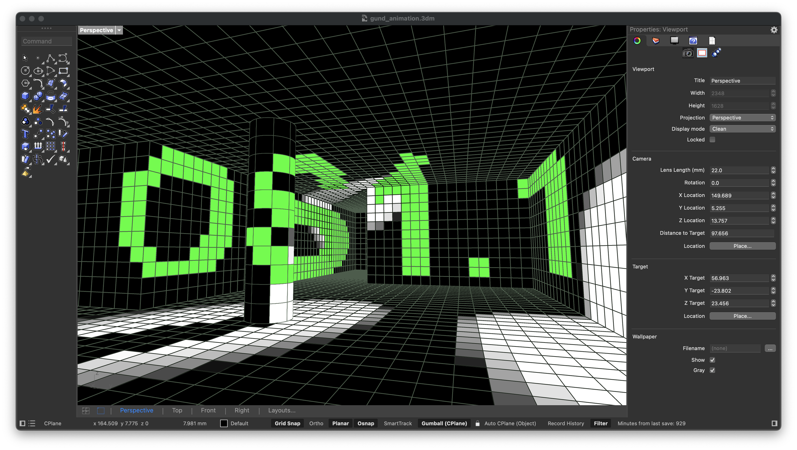
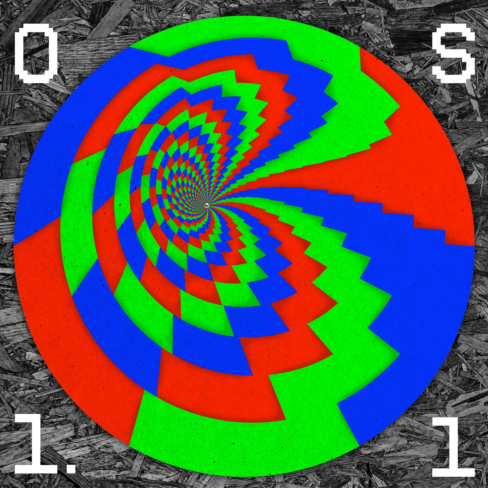
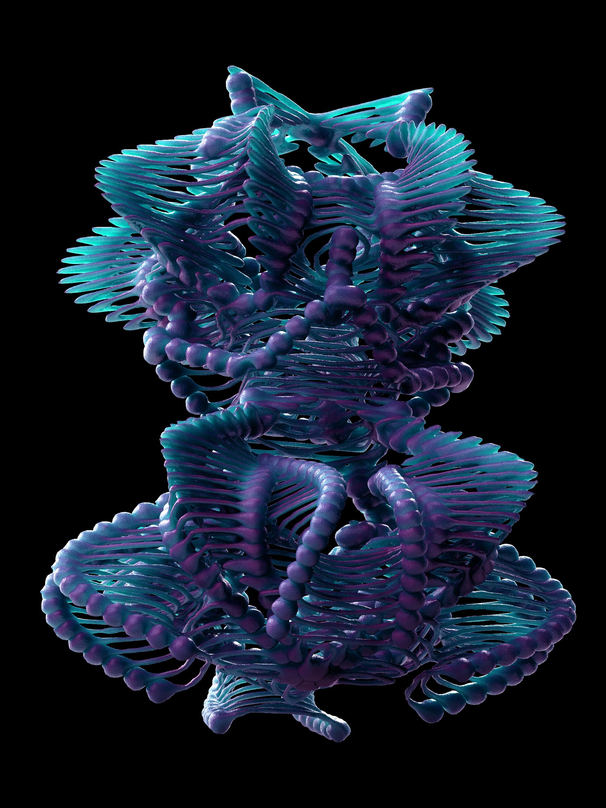
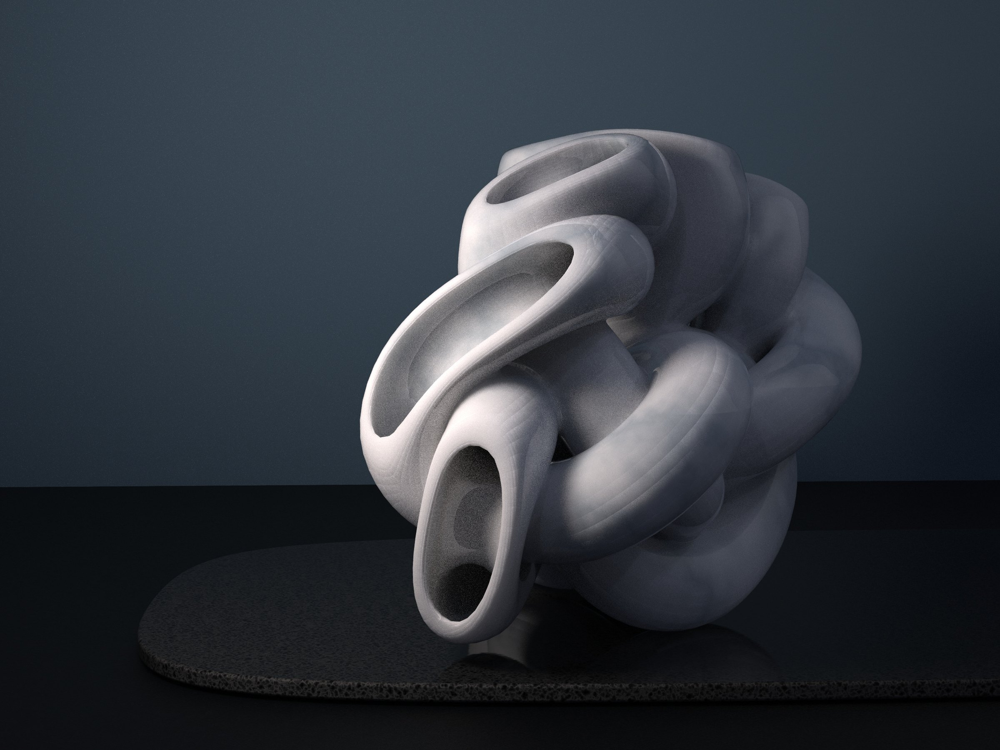
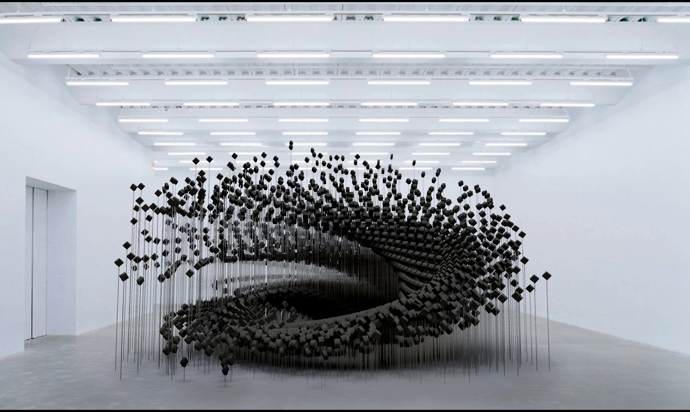

 wide-l

 small-r stagger

[gallery grid3] made-in-gh_03.jpg made-in-gh_04.jpg "Inspired by Zach Lieberman" made-in-gh_05.jpg

 half-l

 half-r stagger

 wide-c

 half-l

 half-r stagger

 wide-r

 half-l

 narrow-r stagger

 wide-l

 full

 wide-r
