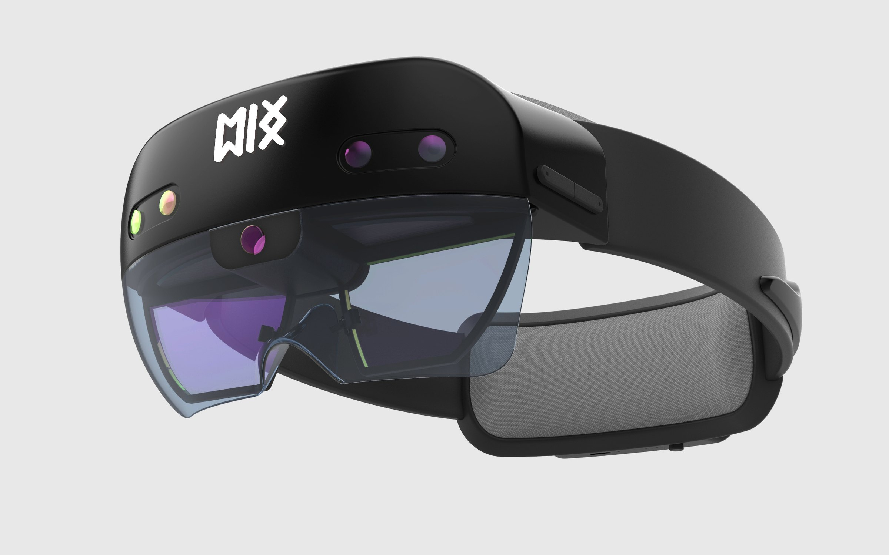
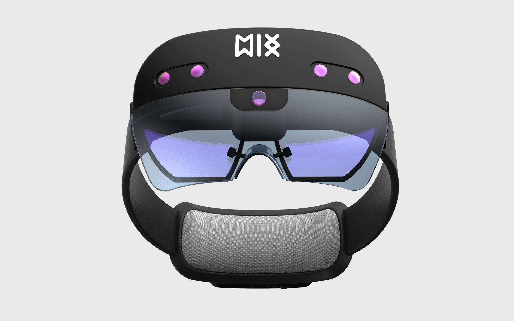
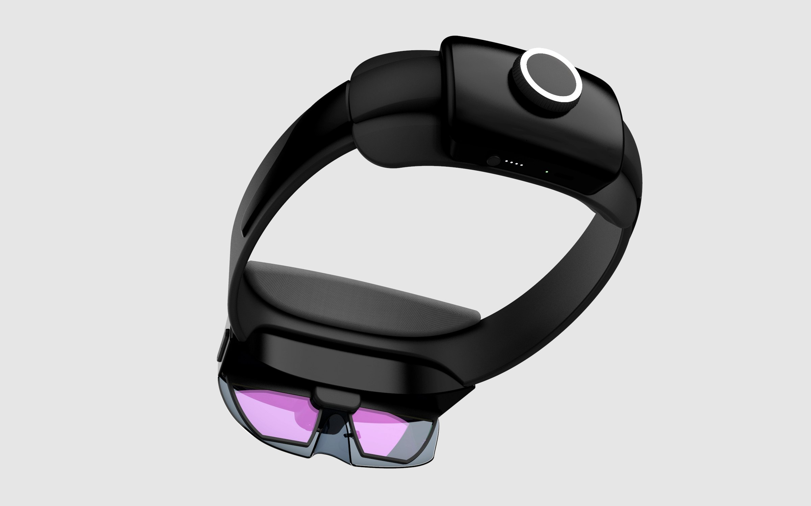
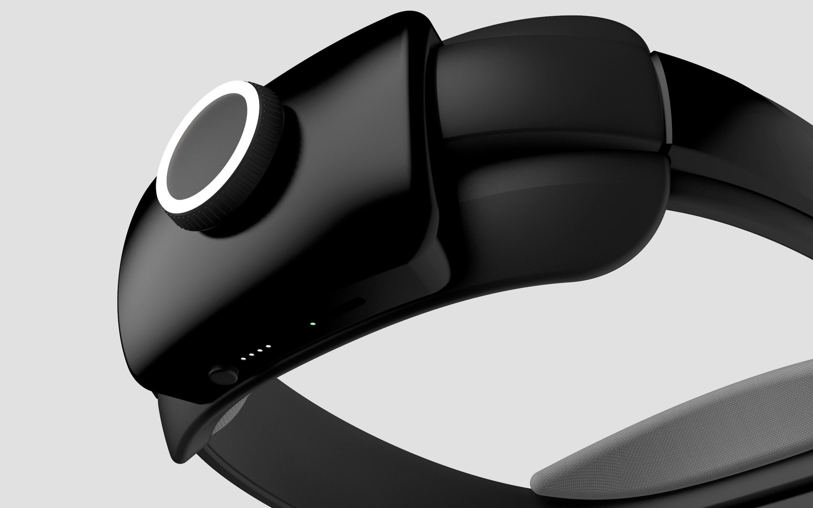
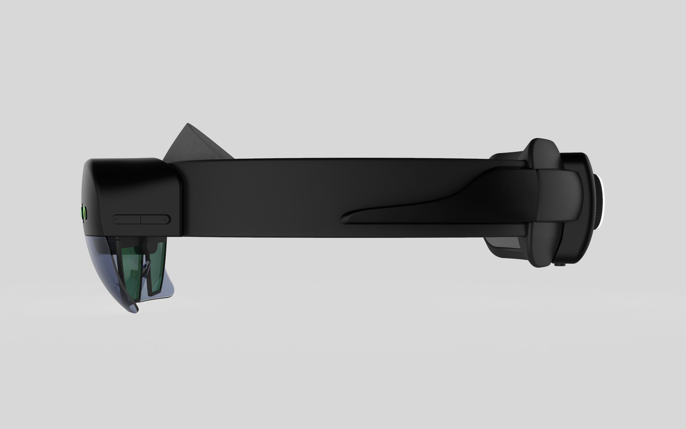
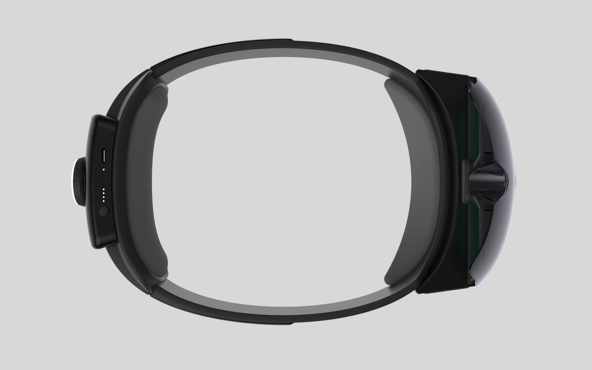

Some very basic modeling and rendering that I did back in sophomore year.\
Just for archive purpose. I took Microsoft Hololens as the reference.

 full

 half-l

 half-r stagger

 wide-r

 half-l

 half-r stagger
