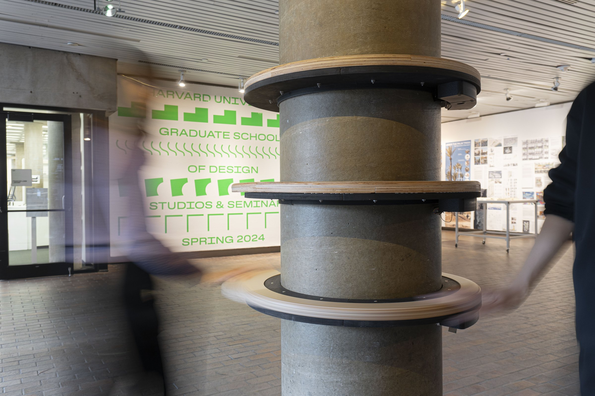
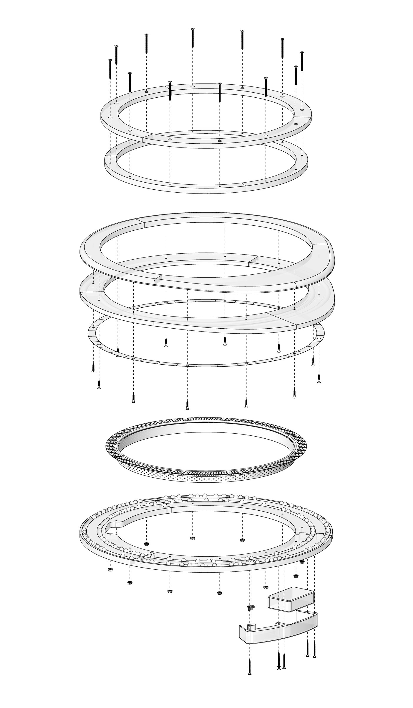
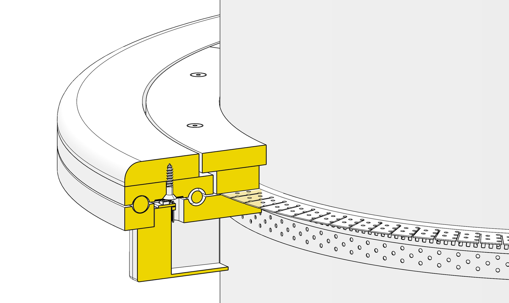
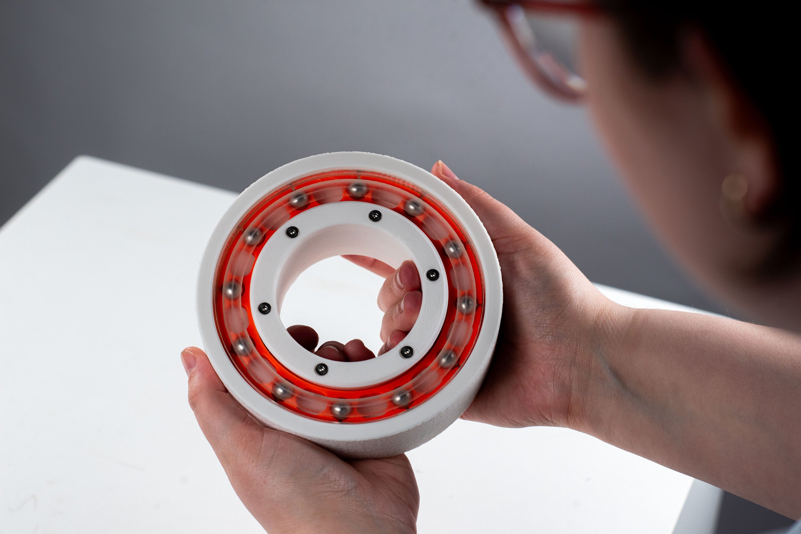
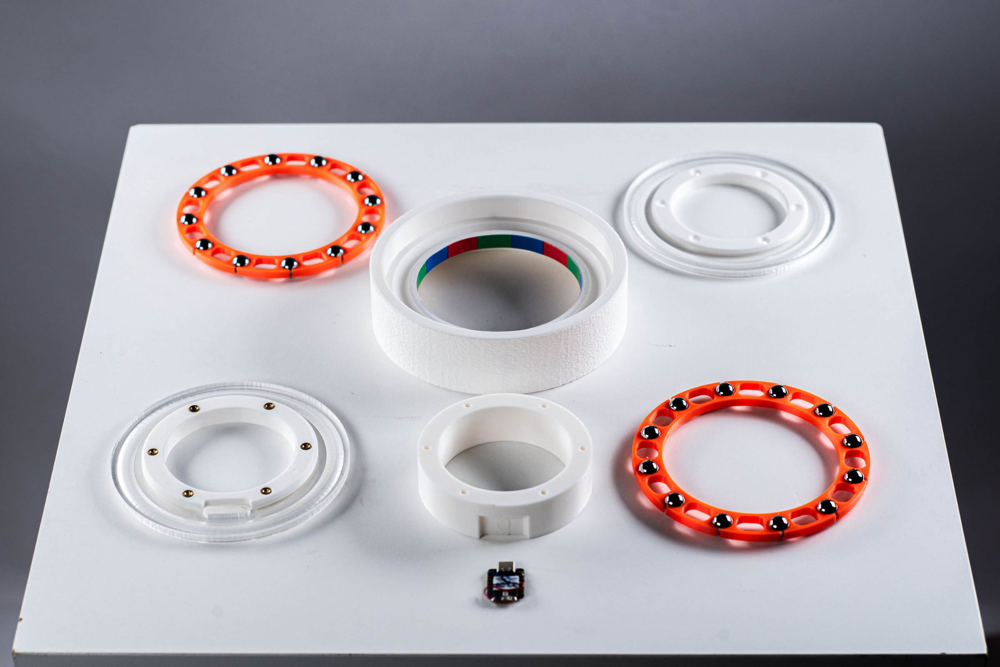
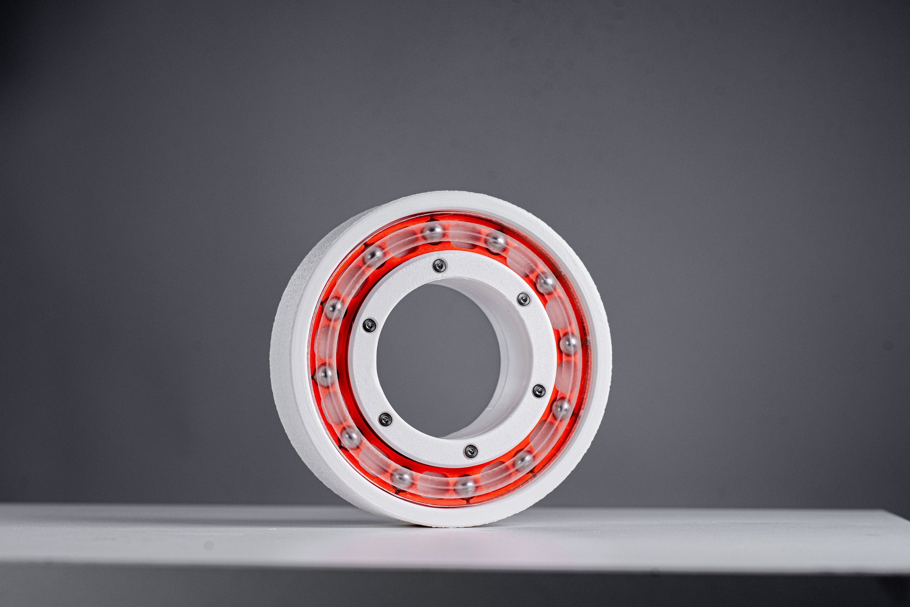

<!-- 使用说明（这段不会显示在网站上，可以删）
段落之间空一行。可以直接改：文字、图片文件名、先后顺序。_sheet.jpg 里有全部图片的缩略图和文件名。

  # 一句话                 整页大字 statement
  ## 标题 / ### 小标题      正文里的标题，后面的段落跟它一组
  [section] 文字           小字分节标签 + 分隔线
                 一张图；后面加一个词指定宽度：full / wide-l / wide-r / half-l / half-r / narrow-l / narrow-r
                           再加 stagger = 比旁边那张往下错开；什么都不加 = 自动排
          图的说明文字（鼠标悬停显示）
         可点击的图
   |   两张并排，底边自动对齐
  [gallery cols=3] a b c   多图组，每行最多 3 张；[gallery carousel] = 轮播；[gallery stack] = 一张一行
  [video] 文件.mp4          带播放条的视频； = 循环小动画
  [row 0.4 0.6] ... [/row] 多列，数字是列宽比例，列和列之间单独一行写 |
  段落末尾 {text-l}         文字固定在左栏（{text-r} 右栏）
  用 HTML 注释包起来         暂时隐藏，文件照留（和这段说明一样的写法）

不想管排版就把排版词删掉，自动规则会排。完整说明：docs/submitting-a-project.md
-->

## OS1.1: Architectural Knob

OS 1.1 harnesses the built infrastructure to extend our sensory registers. We have collaboratively designed an operating system: a lighting network linked by air. As mechanical wooden inputs are touched and turned, lighting outputs change and fluctuate. Manipulation of the physical apparatus directs sensory phenomena along new pathways.

[video audio half-l] os-11_02.mp4

[video audio half-r] os-11_03.mp4

# With the "architectural knob" added, any column could be a control switch.

[gallery grid4 cols=3] os-11_04.jpg os-11_05.jpg os-11_06.jpg os-11_07.jpg os-11_08.jpg

### How does it work?

CNC wood + Hose clamp + Steel balls + DIY RGB Optical encoder

[row 0.375 0.625]

|

[/row]

[gallery carousel] os-11_11.jpg os-11_12.jpg os-11_13.jpg

[video] os-11_14.mp4

[section] OS1.2: Universal through-hole, disassemble, optical rotary encoder

 full

 half-l

 half-r stagger

[video audio] os-11_18.mp4
