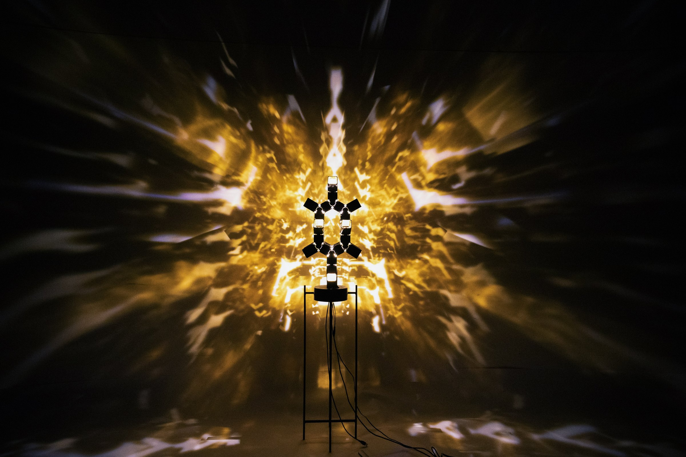
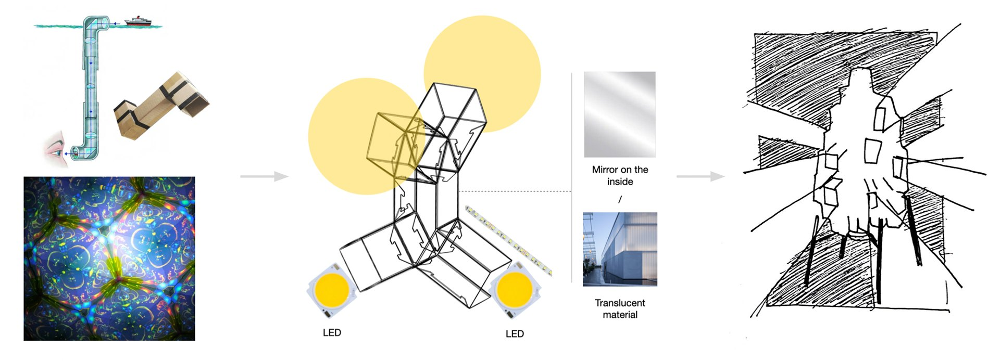
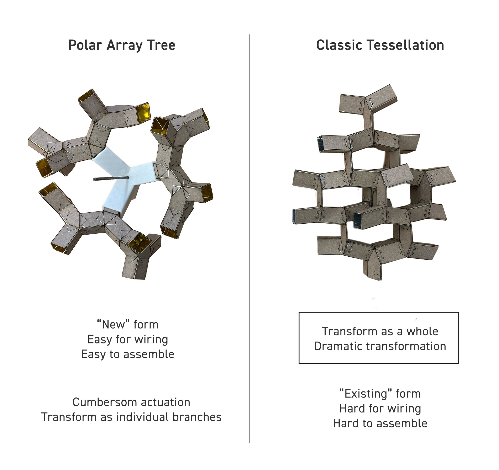
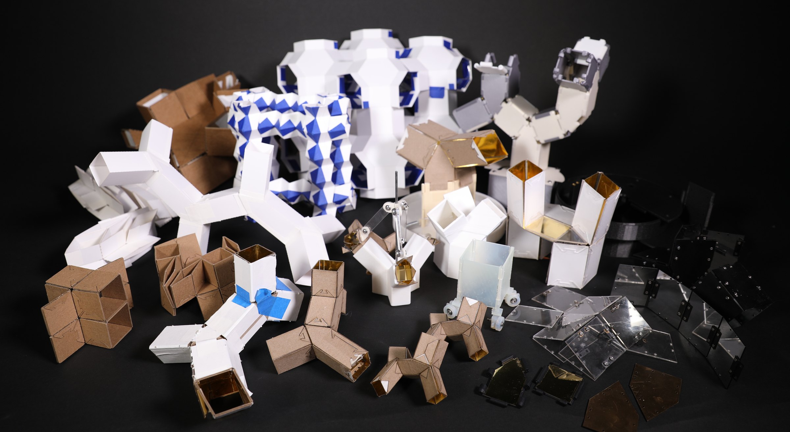
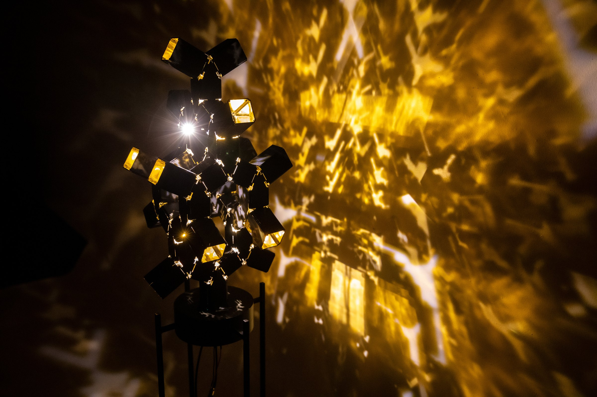
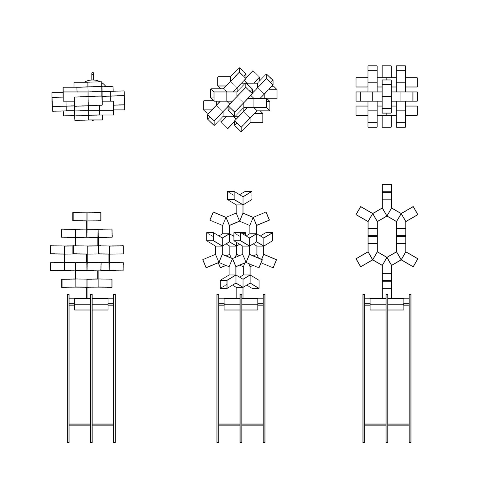

# What will an "Inside-Out" kaleidoscope look like?

Prismo lamp is a modern interpretation of the classic prismatic structure, leveraging its periodic and space-filling properties to create a unique, kinetic aesthetic. {text-l}

[row 0.645 0.355]
Initial InspirationI was first intrigued by the prismatic structure’s movement. The mesmerizing yet unexpected movement makes me wonder how will light bounces inside this structure. A whim suddenly hit me: Why don’t combine periscope and prismatic structure and make an "inside-out kaleidoscope", using prismatic transformation to amplify light?
|

[/row]

 wide-r

[row 0.24 0.76]

|
[video audio] prismo_05.mp4
[/row]

[gallery grid4] prismo_06.jpg prismo_07.jpg prismo_08.jpg prismo_09.jpg

### Base Geometry

The first step was to identify the optimal base geometry. The geometry needed to be tessellatable, and we explored several options including the Truncated Rhombic Dodecahedron, the Rhombic Dodecahedron, and the Prismatic Polyhedron.\
We chose the basic Prismatic Polyhedron with 1 degree of freedom (DOF) for the following reasons: given our limited time and resources, a 1 DOF structure was easier to actuate, allowing us to focus more on design refinements rather than technical challenges; the 1 DOF structure was more straightforward for audiences to understand, as people tend to appreciate things they can easily grasp. {text-l}

### We explored two Y-Shape Polyhedron-based designs: a polar tree and a tessellation structure. The latter was chosen for best highlighting movement through its smart, space-filling mechanics. {half-r}

 half-l

[gallery grid4] prismo_11.mp4 prismo_12.mp4 prismo_13.mp4 prismo_14.mp4

[row 0.375 0.625]
Parametric Design\
I wrote a C# grasshopper script to streamline the design and simulation process for 1 DOF prismatic structures, greatly improving our ability to iterate and refine the design in a timely manner.\
\
\
**[Click here to see how I improved the workflow in details](/transform) >>>**
|

[/row]

[row grid3 0.725 0.275]
[gallery] prismo_16.jpg prismo_17.jpg
|
### Actuation

The lamp’s movement is driven by the actuation of its base parallelogram. By fixing one side of the parallelogram to the base, we were able to drive the whole structure by actuating the non-fixed side using a servo motor.
[/row]

[gallery grid3] prismo_18.mp4 prismo_19.mp4 prismo_20.mp4

### Connection and Material

This was also one of the main challenges of realizing this product. There were three major factors: weight, reflectivity, and connection type:

[1] Since the whole structure is only driven by a single 35 kg servo motor, the main body of the top moving part has to be as light as possible.\
[2] The inside material should be reflective enough for light to bounce multiple times. We found out the more light gets bounced the better the kaleidoscope effect it gets.\
[3] The gap between each panel should be as small as possible to avoid light escape, and the connection should have as little friction as possible to ensure a smooth movement.

The acrylic mirror has the most reflective surface. However, hinges and fasteners are required for connecting laser cut mirror panel. There are mainly three drawbacks of using hinges and fasteners: 1. The assembly process, which requires fastening more than 1000 screws/rivets by hand, is extremely tedious and not flexible enough for maintenance and placing LED strip; 2. Hinge requires leaving huge gap between panels to avoid self-interference; 3. The lamp doesn’t look clean with this many fasteners exposed.\
Taken all consideration, we decided to 3D print the panel because we were able to integrate mechanical hinge into the individual panel.

[gallery section] prismo_21.jpg prismo_22.jpg prismo_23.jpg prismo_24.jpg prismo_25.jpg prismo_26.jpg prismo_27.jpg prismo_28.jpg prismo_29.jpg

[row 0.34 0.66]
### Panel and Base

The panels of the lamp are fabricated through SLS printing which resulted in a clean black matte finish. Given the short time frame, we didn’t fully optimize the panel but there is space for shrinking the edge and acquiring a sleeker look. The movement of the panels is enabled through mechanical hinges which are integrated into the panel designs.

The first panel, which is the fixed side of the base parallelogram, is integrated into the base. We spitted the base in halves to clamp the stand as well as to create space for placing the circuit board.
|
[gallery] prismo_30.png prismo_31.png
[/row]

### Fabrication {wide-l}

[gallery section] prismo_32.jpg prismo_33.jpg prismo_34.jpg prismo_35.jpg prismo_36.jpg prismo_37.jpg prismo_38.jpg prismo_39.jpg prismo_40.jpg

[video full] prismo_41.mp4

[section] Final Product

 half-l

[gallery half-r] prismo_43.jpg prismo_44.jpg

[row grid3 0.625 0.375]

|

[/row]

[video] prismo_47.mp4

[video] prismo_48.mp4

[gallery grid3] prismo_49.jpg prismo_50.jpg prismo_51.jpg
