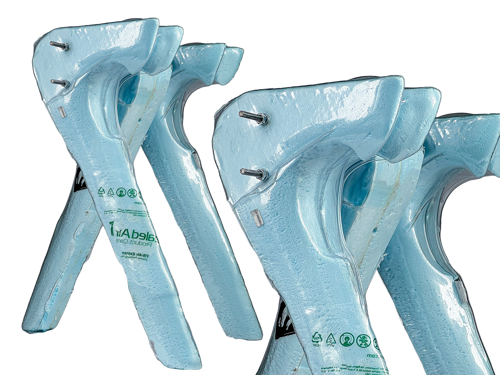

<!-- 使用说明（这段不会显示在网站上，可以删）
段落之间空一行。可以直接改：文字、图片文件名、先后顺序。_sheet.jpg 里有全部图片的缩略图和文件名。

  # 一句话                 整页大字 statement
  ## 标题 / ### 小标题      正文里的标题，后面的段落跟它一组
  [section] 文字           小字分节标签 + 分隔线
                 一张图；后面加一个词指定宽度：full / wide-l / wide-r / half-l / half-r / narrow-l / narrow-r
                           再加 stagger = 比旁边那张往下错开；什么都不加 = 自动排
          图的说明文字（鼠标悬停显示）
         可点击的图
   |   两张并排，底边自动对齐
  [gallery cols=3] a b c   多图组，每行最多 3 张；[gallery carousel] = 轮播；[gallery stack] = 一张一行
  [video] 文件.mp4          带播放条的视频； = 循环小动画
  [row 0.4 0.6] ... [/row] 多列，数字是列宽比例，列和列之间单独一行写 |
  段落末尾 {text-l}         文字固定在左栏（{text-r} 右栏）
  用 HTML 注释包起来         暂时隐藏，文件照留（和这段说明一样的写法）

不想管排版就把排版词删掉，自动规则会排。完整说明：docs/submitting-a-project.md
-->

# What if the flaw in vacuum forming became the structure?

Intentionally create a rib in the vacuum forming process, and use it as a structural reinforcement.

[gallery grid2 @3-11] rib-stool_01.jpg rib-stool_02.jpg

[section] Process

[gallery grid3 cols=3] rib-stool_03.jpg rib-stool_04.jpg rib-stool_05.jpg rib-stool_06.jpg rib-stool_07.jpg rib-stool_08.jpg rib-stool_09.jpg rib-stool_10.jpg rib-stool_11.jpg

[section] Outcome

 wide-l

[gallery @2-12 cols=3] rib-stool_14.jpg rib-stool_15.jpg rib-stool_16.jpg
