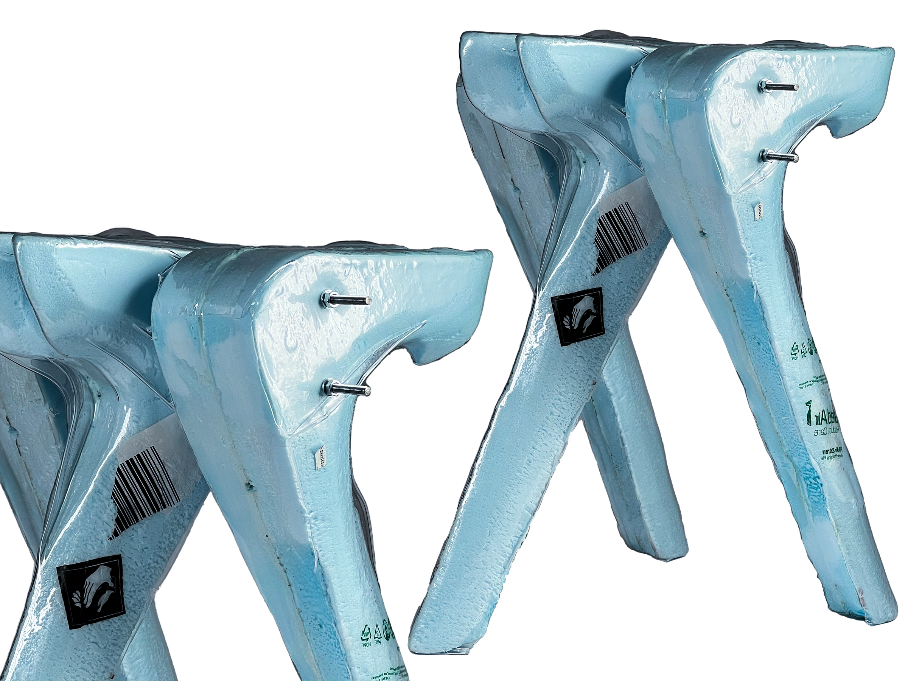
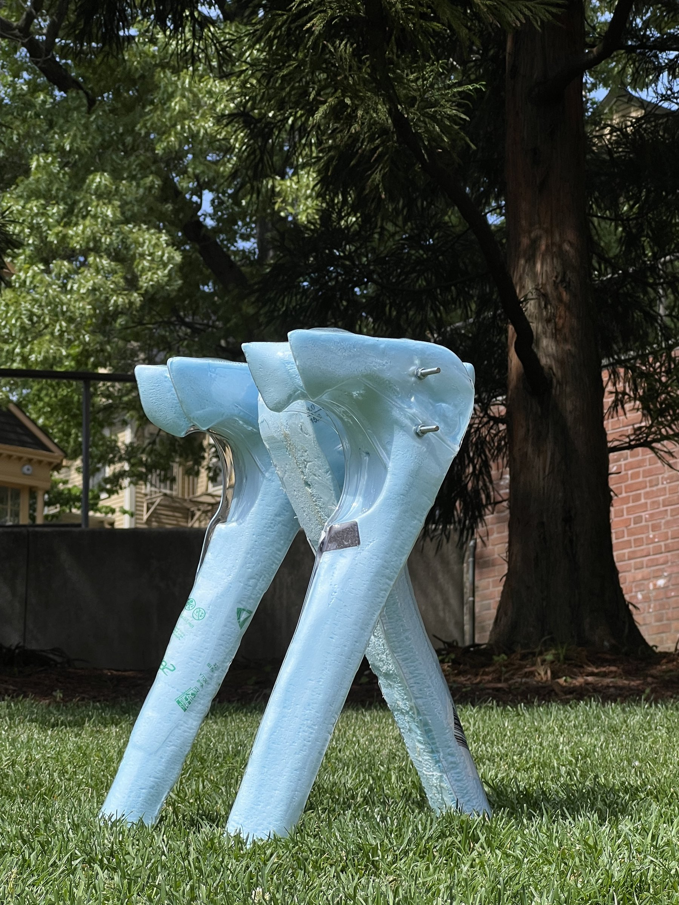

### Intentionally create a rib in the vacuum forming process, and use it as a structural reinforcement.

[gallery grid3] rib-stool_01.jpg rib-stool_02.jpg

[gallery wide-l] rib-stool_03.jpg rib-stool_04.jpg rib-stool_05.jpg rib-stool_06.jpg rib-stool_07.jpg rib-stool_08.jpg rib-stool_09.jpg rib-stool_10.jpg rib-stool_11.jpg

 wide-r stagger

[row 0.585 0.415]

|
[gallery] rib-stool_15.jpg rib-stool_16.jpg
[/row]
