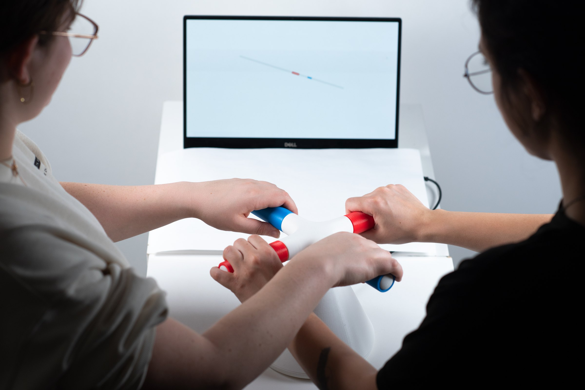
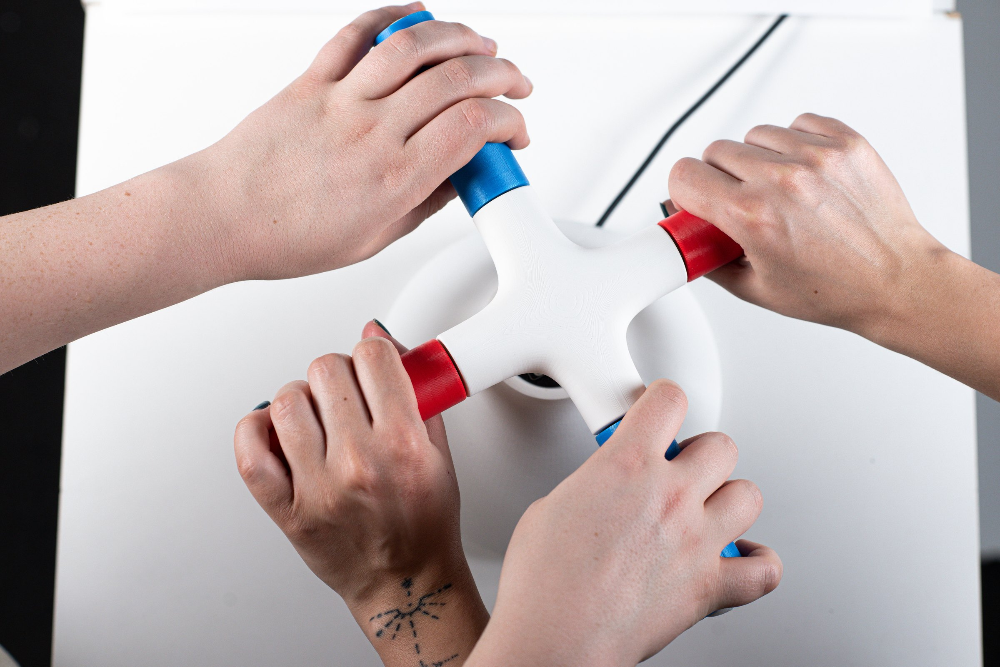
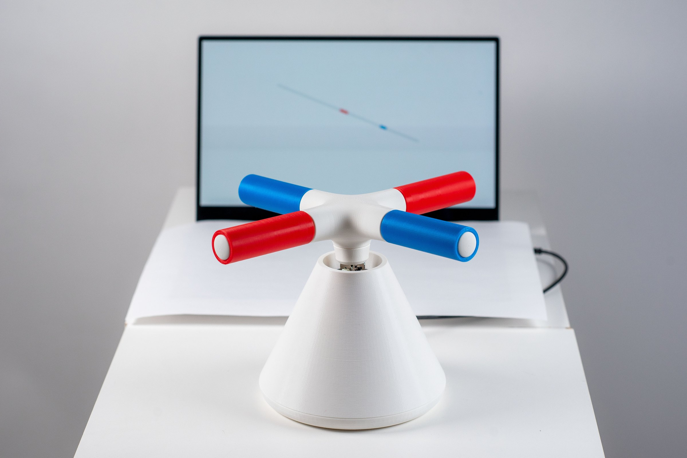
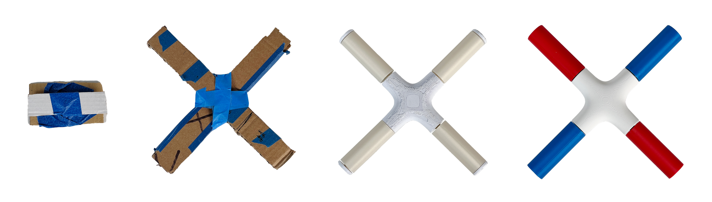
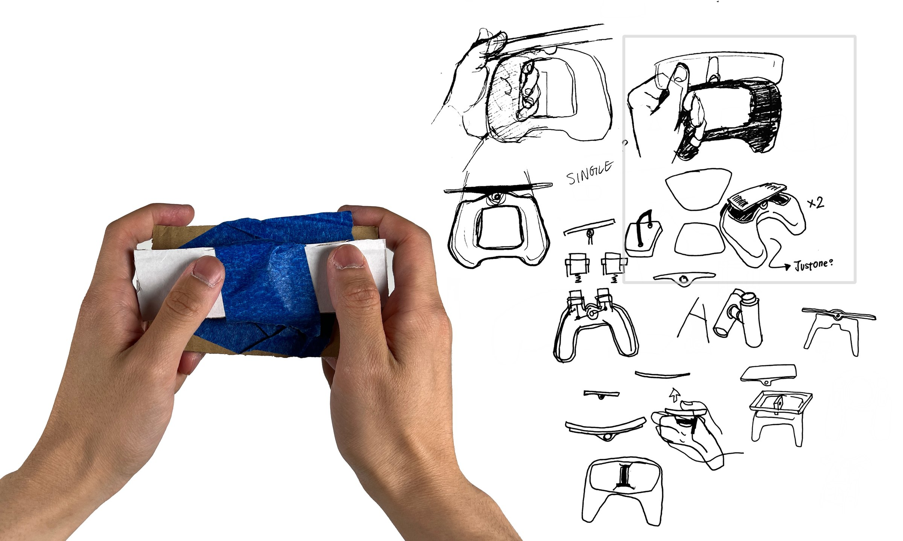
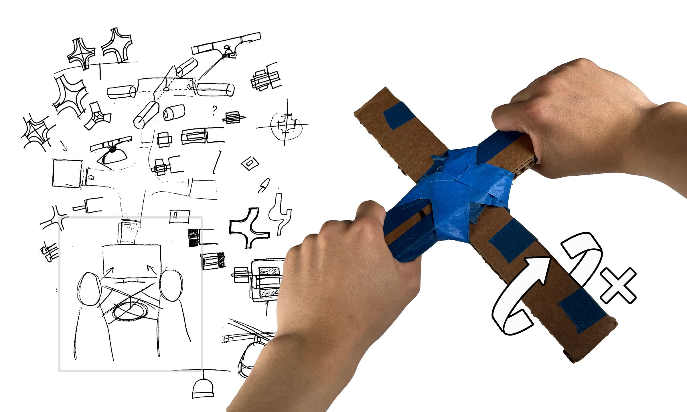
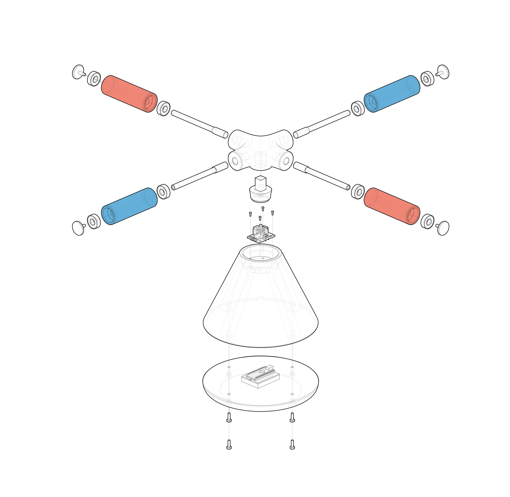
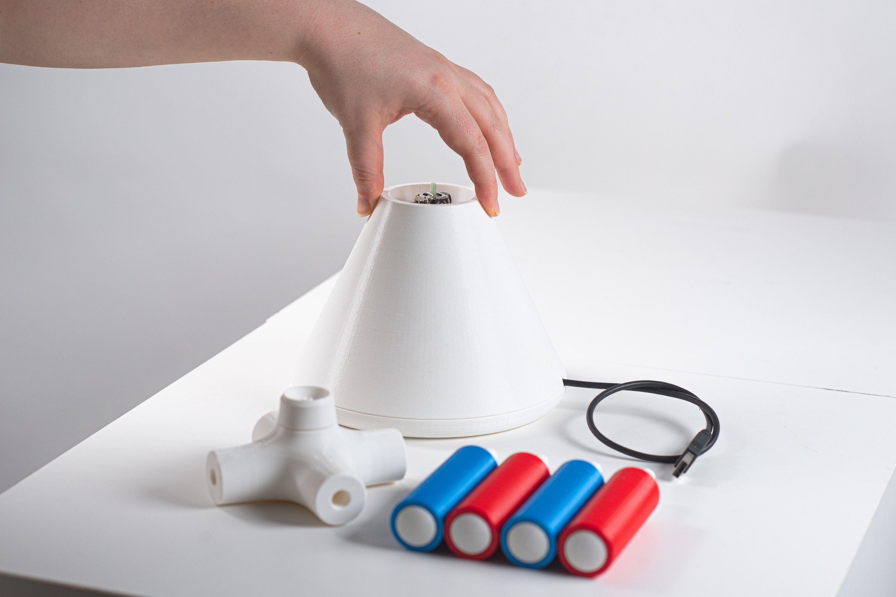
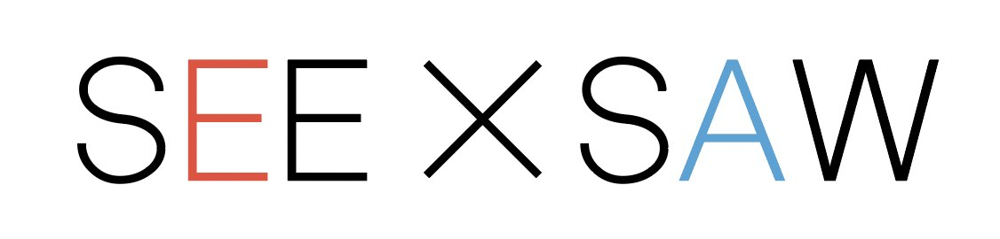

<!-- 使用说明（这段不会显示在网站上，可以删）
段落之间空一行。可以直接改：文字、图片文件名、先后顺序。_sheet.jpg 里有全部图片的缩略图和文件名。

  # 一句话                 整页大字 statement
  ## 标题 / ### 小标题      正文里的标题，后面的段落跟它一组
  [section] 文字           小字分节标签 + 分隔线
                 一张图；后面加一个词指定宽度：full / wide-l / wide-r / half-l / half-r / narrow-l / narrow-r
                           再加 stagger = 比旁边那张往下错开；什么都不加 = 自动排
          图的说明文字（鼠标悬停显示）
         可点击的图
   |   两张并排，底边自动对齐
  [gallery cols=3] a b c   多图组，每行最多 3 张；[gallery carousel] = 轮播；[gallery stack] = 一张一行
  [video] 文件.mp4          带播放条的视频； = 循环小动画
  [row 0.4 0.6] ... [/row] 多列，数字是列宽比例，列和列之间单独一行写 |
  段落末尾 {text-l}         文字固定在左栏（{text-r} 右栏）
  用 HTML 注释包起来         暂时隐藏，文件照留（和这段说明一样的写法）

不想管排版就把排版词删掉，自动规则会排。完整说明：docs/submitting-a-project.md
-->

## How to make a simple '1D' game that encourages physical collaborations?

See Saw is a one-dimensional game that encourages collaboration between two players who share a single controller. As they slide along the rail, the players must maintain balance and overcome growing challenges. The project involves both software and hardware development. The game is coded within the p5js environment and receives data from Arduino via a serial port. This page will concentrate on the hardware design process.

 full

 half-l

 half-r stagger

[section] How to play

[gallery grid3] seesaw_03.jpg "Each player controls one block. Tilt the handle to move." seesaw_04.jpg "The size represents weight. The heavier the longer." seesaw_05.jpg "Similar to a see-saw, it tilts! Try to balance it."

[gallery grid3] seesaw_06.jpg "1/3:The block bounces back when it hits another block" seesaw_07.jpg "2/3:The block bounces back when it hits another block" seesaw_08.jpg "3/3:The block bounces back when it hits another block"

[section] Controller development

 full

[row 0.705 0.295]

|
### First iteration: see-saw

The initial controller simply merged a conventional game controller with a see-saw. While the interaction was natural, it failed to foster collaboration---players only use their individual controllers to play the game.
[/row]

[row 0.3 0.7]
### Second iteration: cross

To promote physical interaction, we combined two see-saws into a cross-shaped controller. This distinctive design encourages players to engage with each other's bodies, adding an extra element of fun. However, the basic cardboard prototype restricts independent movement for players.
|

[/row]

[row]
[video audio] seesaw_12.mp4
|
[video audio] seesaw_13.mp4
[/row]

### Third and fourth iteration: free rotation

The solution to the movement problem was to introduce an extra degree of freedom. The third prototype effectively used a rod and a slightly larger hole, but it lacked a polished look and feel. To elevate the user experience, I added two bearings on each handle, resulting in smoother rotation and a premium feel. You can clearly tell the difference when you grab it in your hands.

 half-r

Thanks to the cross-shaped design, the electronic components are straightforward, requiring only one joystick and an Arduino board. The joystick's X value corresponds to Player 1's acceleration, while the Y value corresponds to Player 2's acceleration.

 wide-l

[youtube start=7] https://www.youtube.com/watch?v=kxqCKvFvQow

 small-l
