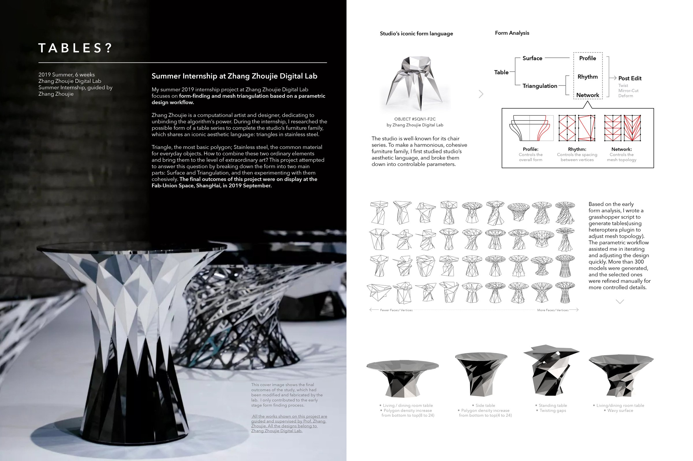
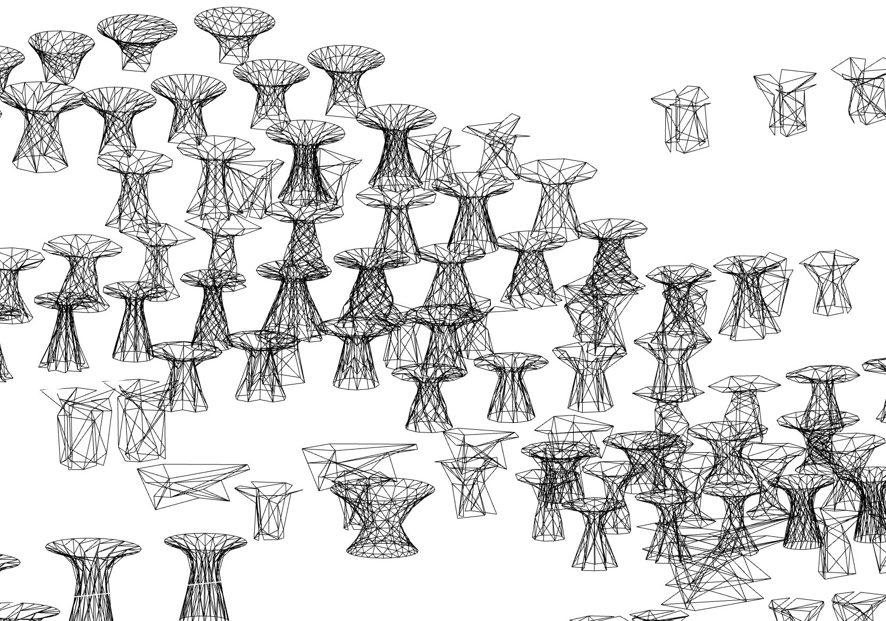
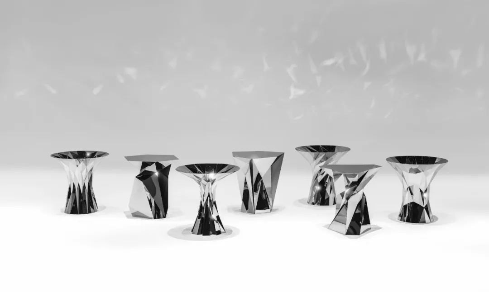
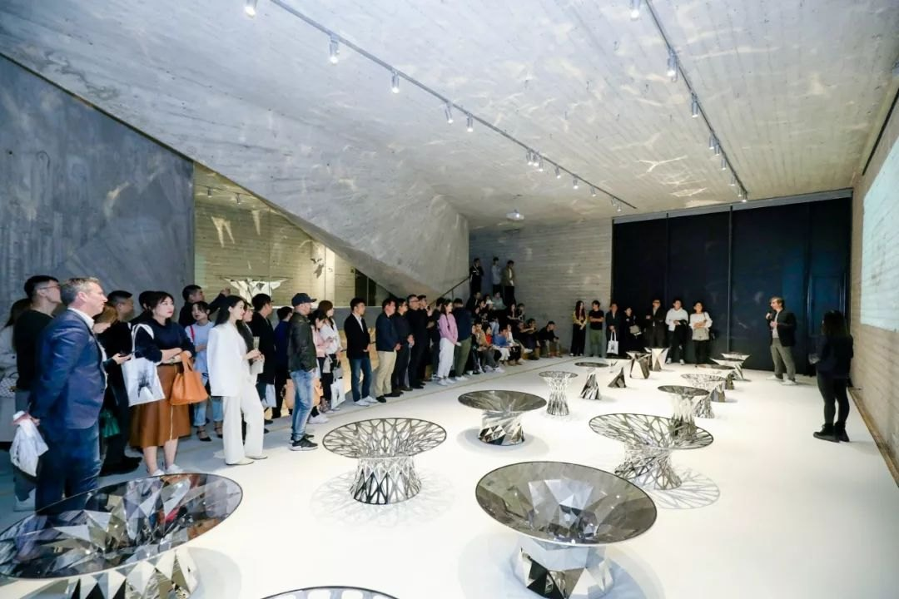
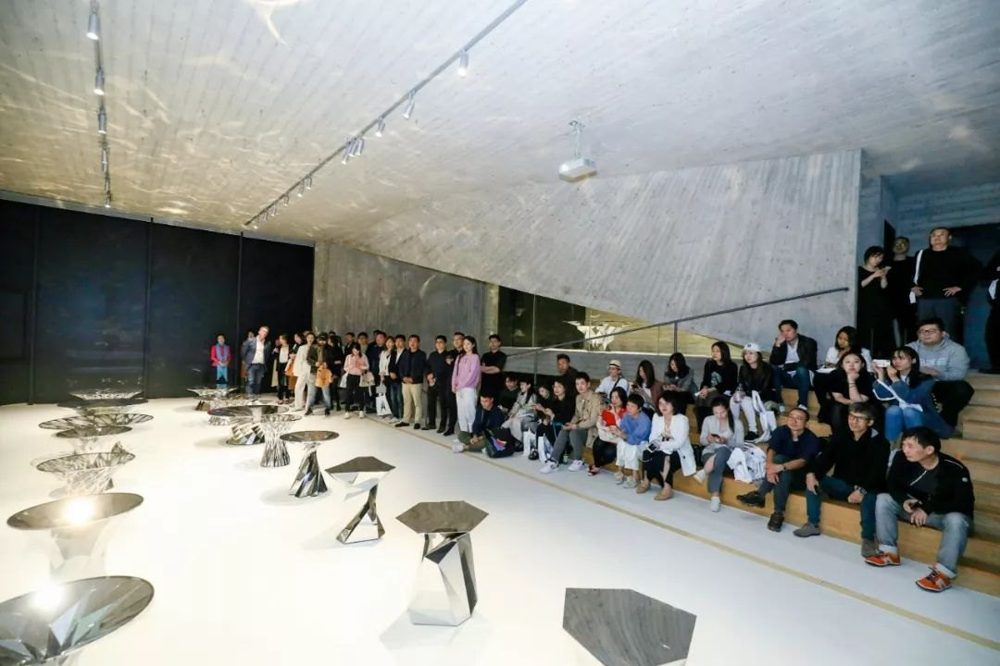

 full

All the works/image belong to Zhang Zhoujie and Endless form. {credits}

 half-l

[gallery grid3] tables_03.mp4 tables_04.mp4 tables_05.mp4 tables_06.jpg tables_07.jpg tables_08.jpg tables_09.jpg tables_10.jpg tables_11.jpg

 wide-r

 | 
