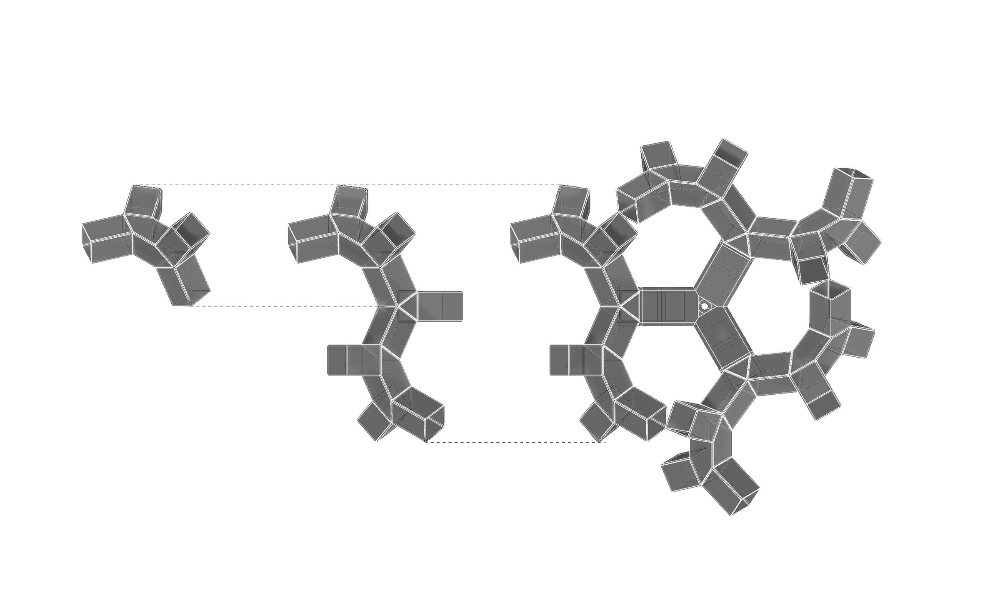
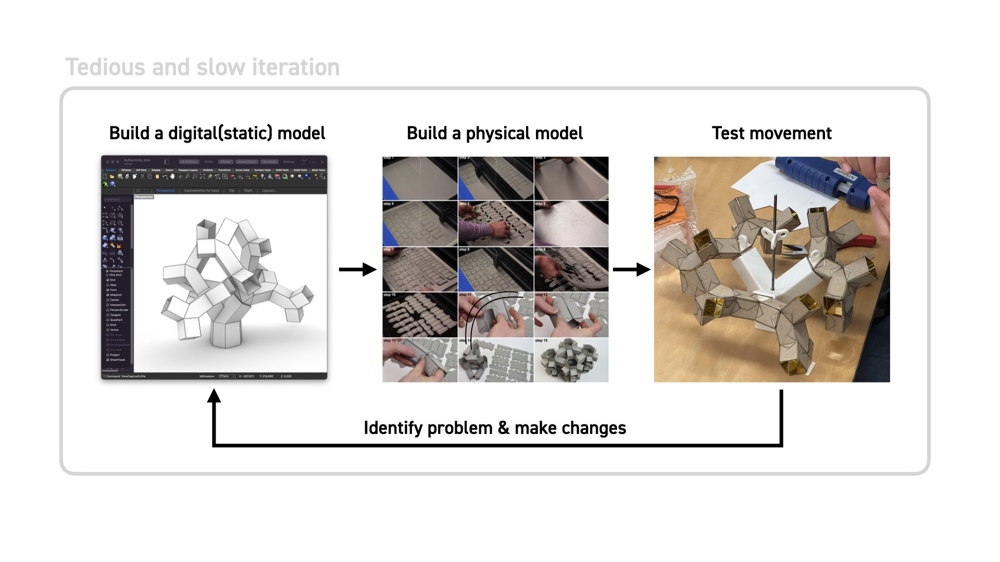
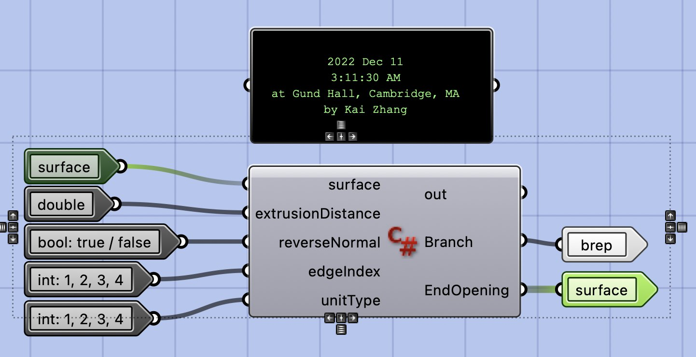
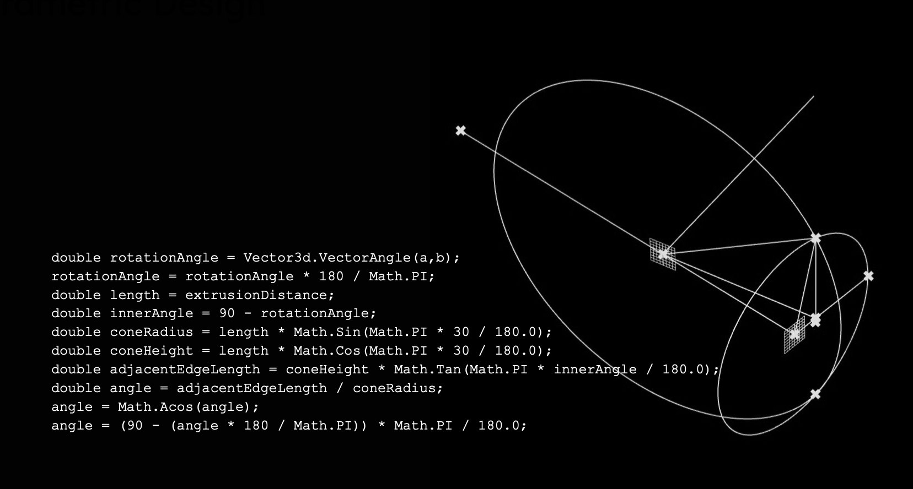

[row 0.305 0.695]
### Abstract

This project is part of the development process of prismo, a transformable lamp based on the prismatic structure. This parametric tool provides convenience for users to intuitively edit 1 DOF prismatic structure’s aggregation and simulate its movement in real time. With the help of this tool, I was able to iterate multiple designs and test their movement purely in the digital environment, which greatly speeds up the development process.

### [Click here to see more about the prismo lamp.](/prismo)
|

[/row]

[section] Polar Array Design

[row 0.3751 0.6249]

|

[/row]

[row 0.295 0.705]
ProblemThe conventional workflow working with prismatic structure is labor-intensive and time-consuming: Noticing the low efficiency, I realized there is a strong need for a digital parametric tool that could be used to accelerate the design iteration process.\
The tool should enable designers to design and simulate movement in the digital environment to freely (and more efficiently) explore more potential opportunities.
|

[/row]

[row 0.625 0.375]

|
### Solution

Since the goal of this tool is to help people design, it has to be user-friendly and intuitive to use. I decided to use a modular component to represent each unit. This software architecture allows users directly see the connection between individual input parameters and output geometry.
[/row]

[row]
[video] transform_06.mp4
|
[video] transform_07.mp4
[/row]

[row 0.375 0.625]
### Challenge

The challenge is to understand the math behind the transformation: The input angle and output angle do not map linearly. At the first attempt, I called intersect functions from RhinoCommon as a hard way to solve the geometrical equation. It works, but the intersection method is a bit clumsy computation-wise.

I further broke down the geometry relationships into trigonometric equations. This change not only simplify the code and also increase computational efficiency.
|

[/row]

[section] Output tests

[gallery grid4 cols=3] transform_09.mp4 transform_10.mp4 transform_11.mp4 transform_12.mp4

[video] transform_13.mp4
