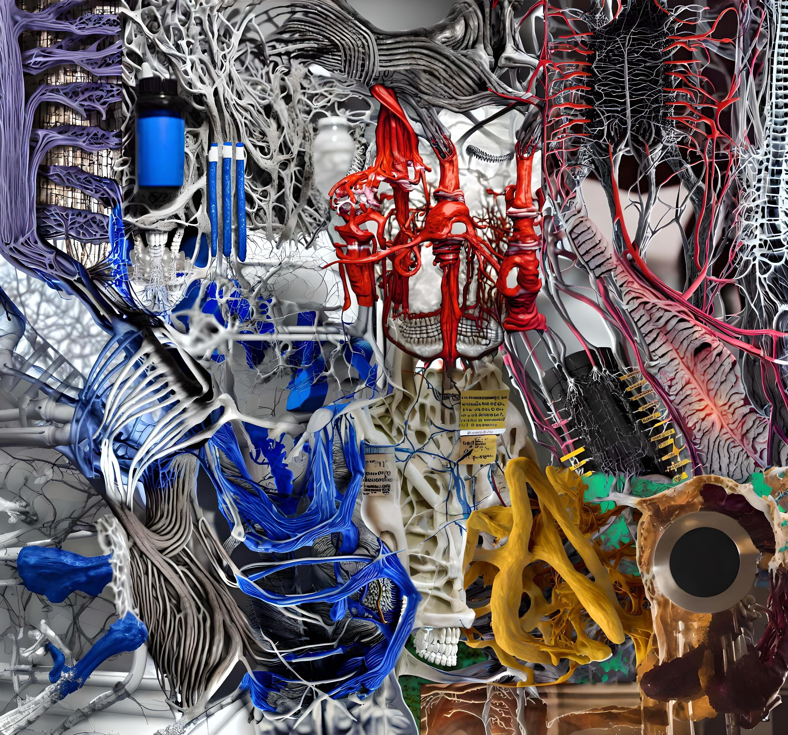
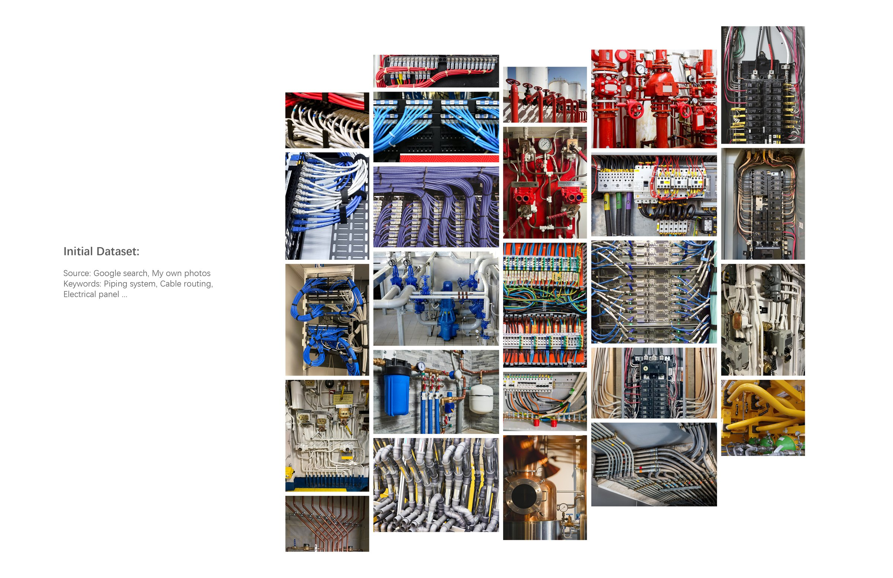
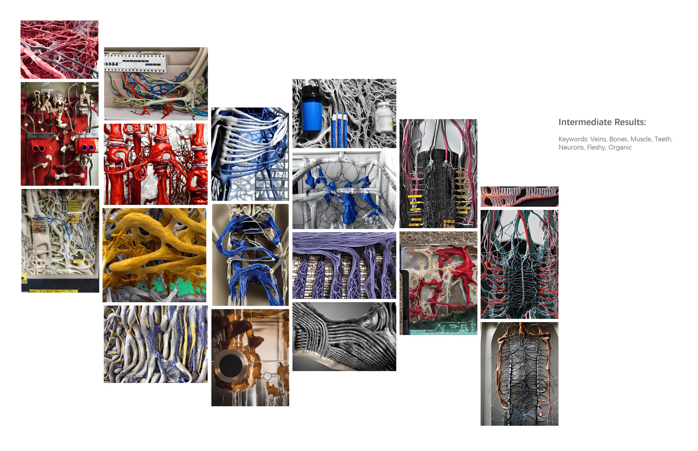

<!-- 使用说明（这段不会显示在网站上，可以删）
段落之间空一行。可以直接改：文字、图片文件名、先后顺序。_sheet.jpg 里有全部图片的缩略图和文件名。

  # 一句话                 整页大字 statement
  ## 标题 / ### 小标题      正文里的标题，后面的段落跟它一组
  [section] 文字           小字分节标签 + 分隔线
                 一张图；后面加一个词指定宽度：full / wide-l / wide-r / half-l / half-r / narrow-l / narrow-r
                           再加 stagger = 比旁边那张往下错开；什么都不加 = 自动排
          图的说明文字（鼠标悬停显示）
         可点击的图
   |   两张并排，底边自动对齐
  [gallery cols=3] a b c   多图组，每行最多 3 张；[gallery carousel] = 轮播；[gallery stack] = 一张一行
  [video] 文件.mp4          带播放条的视频； = 循环小动画
  [row 0.4 0.6] ... [/row] 多列，数字是列宽比例，列和列之间单独一行写 |
  段落末尾 {text-l}         文字固定在左栏（{text-r} 右栏）
  用 HTML 注释包起来         暂时隐藏，文件照留（和这段说明一样的写法）

不想管排版就把排版词删掉，自动规则会排。完整说明：docs/submitting-a-project.md
-->

# Infrastructure, reimagined as flesh.

[row 0.55 0.45]

|
This project explores the vitality of complex piping and cable systems by transforming them into organic, fleshy, living structures with runwayML. The intricate network of these systems has always fascinated me, resembling a living organism that serves a specific purpose. Each pipe and cable contributes to the overall functionality of the system, and removing one component can disrupt the entire process, much like the biological body. To achieve this transformation, the project used a dataset collected from Google searches and personal photography. The keywords for the img2img process are veins, bones, muscles, and neurons. By transforming these systems into organic structures, the project aims to stimulate new ways of understanding these infrastructures and explore their potential for alternative visual and conceptual interpretations.
[/row]

 wide-l

 wide-r stagger

