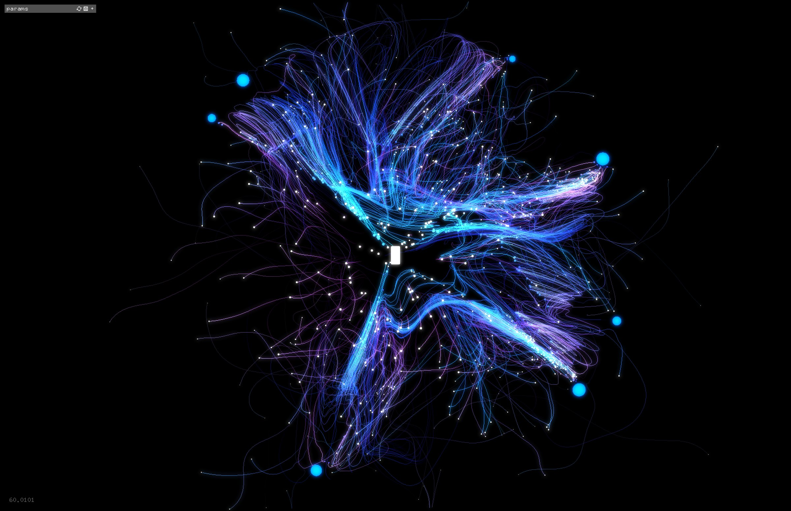
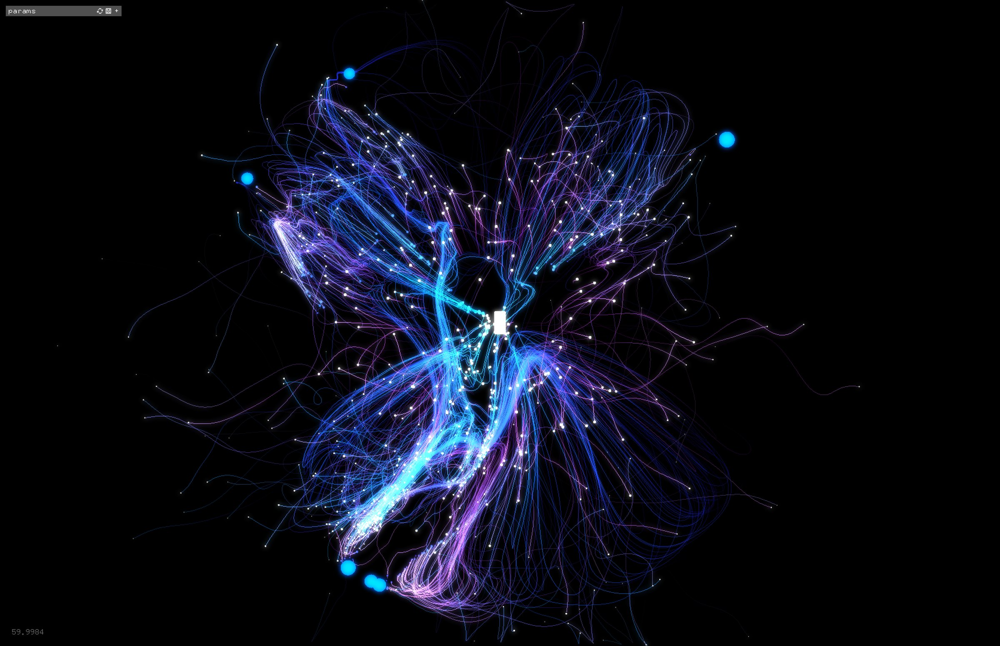
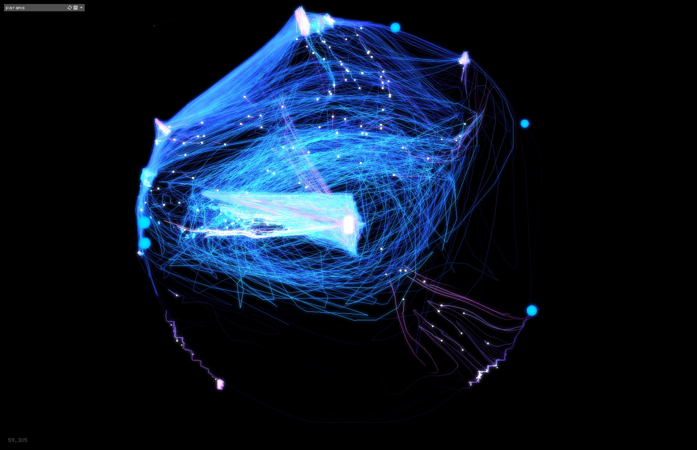
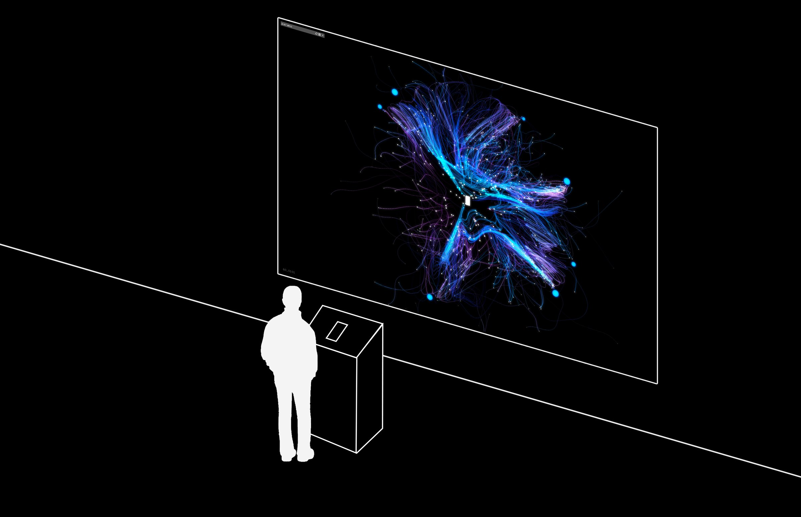

Yottabyte is an interactive piece that reveals the non-stop, gigantic yet invisible data comsumption.

Made in Openframeworks using C++.

# Will we be aware when we consume 1,000,000,000,000,000,000,000,000 bytes?

 full

 half-l

 half-r

 wide-l

[video full] yottabyte_05.mp4

[video half-l] yottabyte_06.mp4

[video half-r] yottabyte_07.mp4
